# 架构演进与运维方案

> 涵盖：现状分析 → 服务拆分与迁移 → 数据库职责分离 → 数据安全 → 节点扩缩容 → 容灾恢复 → 读写一致性
>
> 最后更新：2026-08-05

---

## 一、架构回顾

### 1.1 当前架构

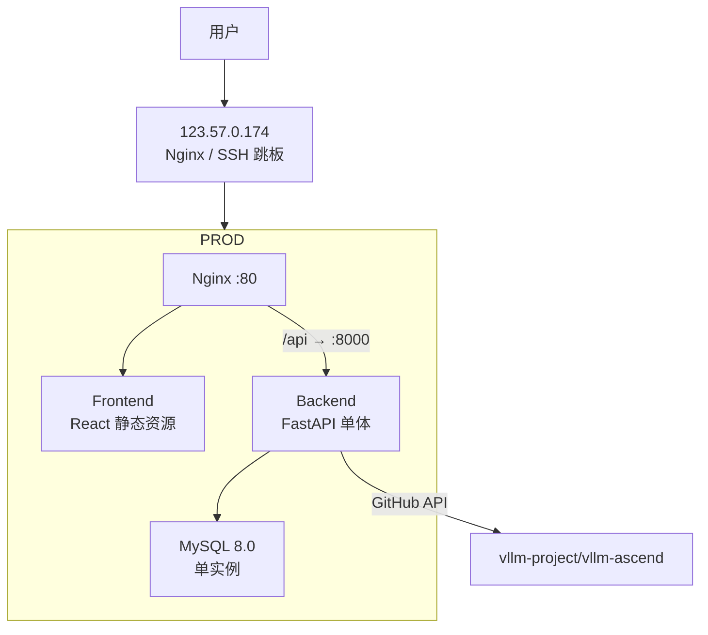

| 维度 | 当前状态 |
|------|---------|
| 计算节点 | 1 台（190.92.220.4） |
| 数据库 | MySQL 8.0 单实例，无副本，binlog 未开启 |
| 部署方式 | Docker Compose（`docker-compose.prod.yml`） |
| 服务形态 | 单体 FastAPI：API + Scheduler + Collector + Query 一体 |
| 备份 | `mysqldump --single-transaction` + 恢复校验 + SHA256，每小时 cron |
| 部署脚本 | `deploy_prod.sh`：9 步部署，含自动备份 + 校验 + 自动回滚 |
| 网络 | 公网 → 跳板机 → 生产服务器，无内部网络 |

### 1.2 目标架构

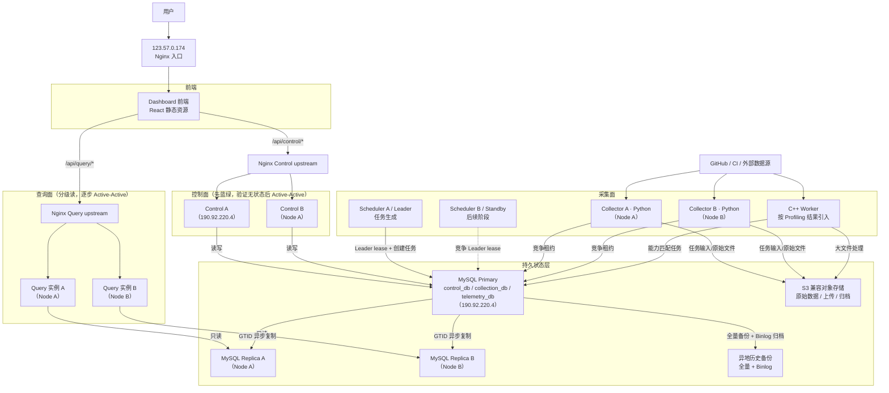

### 1.3 节点分配

架构必须同时支持“当前最小形态”和“未来弹性形态”。服务边界不能以节点数量为前提。

#### 1.3.1 当前最小形态：2 台设备、1 个计算节点

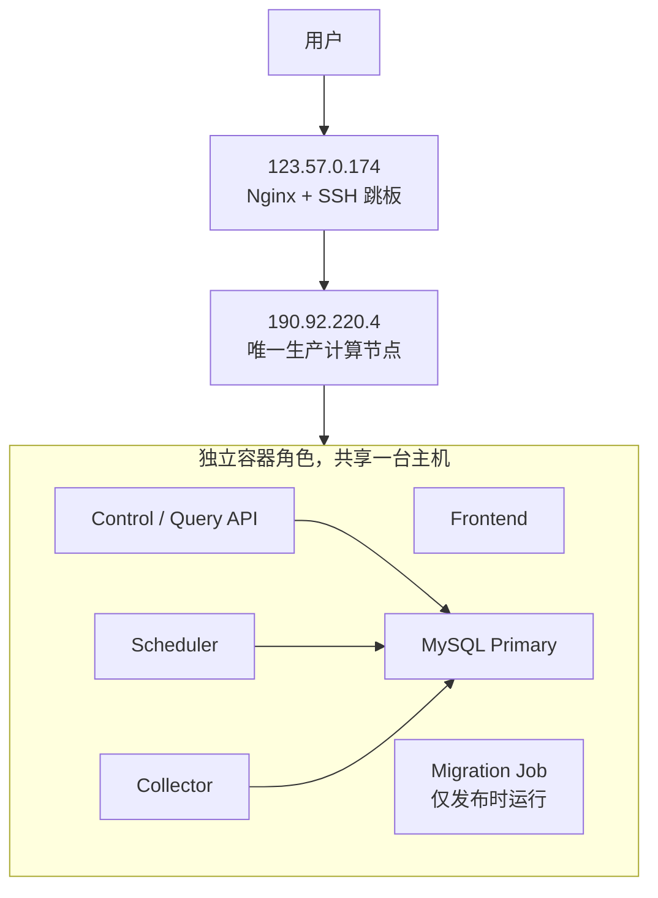

最小形态没有在线容灾，但必须具备异地备份、Binlog、PITR和从新节点重建的能力。即使角色运行在同一台主机，也必须保持独立进程、独立启动命令和明确的数据所有权。

最低资源基线：

| 节点 | CPU | 内存 | 磁盘 | 约束 |
|------|-----|------|------|------|
| 跳板机 | 1 核 | 512MB~1GB | 10~20GB | 只运行 Nginx/SSH，不保存长期备份 |
| 生产机 | 2~4 核 | 4~8GB | 60~100GB SSD | 4GB 时限制连接池、并发和 MySQL Buffer Pool；磁盘保持 ≥ 25% 空闲 |

#### 1.3.2 弹性形态：1~N 个标准计算节点

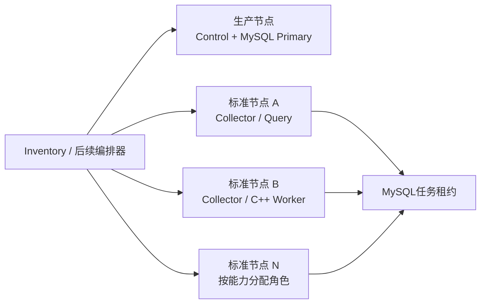

新增节点首先扩展 Collector/C++ Worker，其次扩展 Query/Control；MySQL Replica、备份等有状态角色只有在磁盘、故障域和恢复检查通过后才分配。

| 节点 | 角色 | 标签 |
|------|------|------|
| `190.92.220.4` | Control、Scheduler Leader、MySQL Primary | `zone=aliyun, storage=ssd, database_eligible=true` |
| Node A | Collector、Query、Control、MySQL Replica A | `zone=office-a, compute=high, database_eligible=true` |
| Node B | Collector、Query、MySQL Replica B | `zone=office-b, compute=high, database_eligible=true` |
| Node C（远期） | Collector、构建、监控、备份演练 | `zone=office-a, availability=best-effort` |

**Query 分阶段采用 Active-Active**：第一阶段轻量查询读 Primary，重型分析查询灰度读 Replica；副本稳定、降级策略验证通过后，两个 Query 实例同时接收流量。重型查询在副本不可用时默认降级，不自动冲击 Primary。

**Control 分阶段采用 Active-Active**：先使用 Blue/Green + 单活流量，确认 Scheduler、Migration、同步进度、本地缓存和宿主机控制全部移出 API 进程后，再由 Nginx upstream 同时启用两个实例。

**节点不绑定操作系统或永久角色**：Node A/B/C 只是 Inventory 中的逻辑名称。Windows 设备通过 Hyper-V Ubuntu Server VM 提供标准 Linux 节点；原生 Linux、云服务器和 Ubuntu VM 使用相同的 OCI 镜像、Compose 角色文件、SSH/Tailscale 接口和目录约定。

### 1.4 当前 vs 目标的真实 Gap

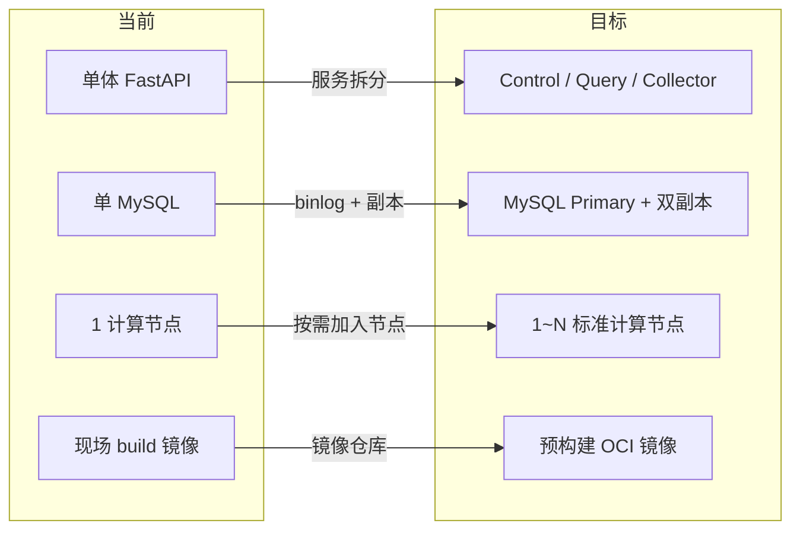

---

## 二、服务拆分与数据迁移

### 2.1 调整后的实施顺序

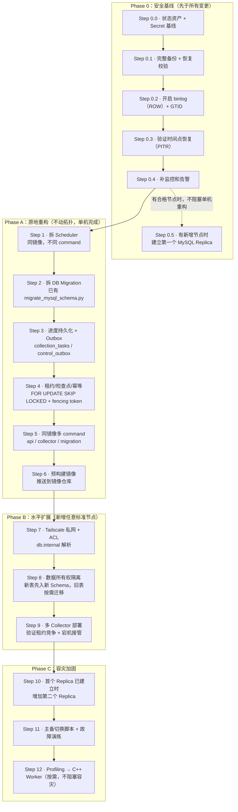

### 2.2 各 Step 详解

#### Phase 0：安全基线（先于所有变更）

当前数据库无副本、binlog 未开启。后续 Step 3~8 涉及建表、改 schema、拆分数据库——一旦误操作，只能恢复到最近一次全量 dump，无法做时间点恢复（PITR）。因此 **binlog 必须在所有高风险数据库变更之前开启**。

---

#### Step 0.0：状态资产与 Secret 基线

在增加节点之前，先把状态分为三类并登记所有者、路径、备份方式和恢复方法：

| 类型 | 示例 | 处理方式 |
|------|------|---------|
| 权威状态 | MySQL、数据源定义、任务检查点、用户上传 | 必须备份、复制并演练恢复 |
| 可重建状态 | Git 仓库缓存、前端产物、查询缓存 | 节点失败后重新生成 |
| Secret | MySQL 密码、GitHub Token、Tailscale Key、TLS 私钥 | 加密保存、按服务分发、可撤销和轮换 |

最低 Secret 基线：

```
□ Secret 不进入普通 Git、镜像层和部署日志
□ Control / Collector / Query / Scheduler 使用不同凭据
□ 加密配置包带 config_version 和 SHA256
□ 新节点只获得其角色需要的 Secret
□ 节点退出后可以撤销其数据库账户、Tailscale 身份和 Token
□ 解密密钥与密文备份不存放在同一位置
```

非数据库文件必须同时盘点：`backend_data`、用户上传、报告附件、原始采集文件、TLS 证书和任务中间文件。可重建内容留本地缓存；唯一业务文件进入对象存储或版本化异地备份。

---

#### Step 0.1：完整备份 + 恢复校验

```bash
bash operations/production/backup.sh --verify-restore
# 确认 backup file + .meta 文件都生成，restore_verified=true
```

> **实施门禁**：当前仓库的 `operations/production/backup.sh` 仍只读取单个 `${MYSQL_DATABASE}`，且 `mysqldump` 尚未包含 `--source-data=2`。在依赖PITR坐标、执行跨Schema迁移或正式拆分 `control_db / collection_db / telemetry_db` 前，必须先升级备份脚本并完成隔离恢复测试。文档中的三库备份命令是目标实现，不能视为当前脚本已经具备的能力。

升级后的备份验收：

```text
□ control_db / collection_db / telemetry_db 全部进入备份
□ routines / triggers / events 全部进入备份
□ dump 或独立 .meta 记录 GTID 与 Binlog 恢复起点
□ SHA256 校验通过
□ 在隔离 MySQL 实例恢复成功
□ 表数、用户数和关键数据行数一致
□ 可以从备份恢复点继续应用后续 Binlog
```

---

#### Step 0.2：开启 binlog + GTID

```ini
# deploy/config/mysql.cnf — 取消注释并补充
[mysqld]
server_id = 1
log_bin = /var/log/mysql/mysql-bin
binlog_format = ROW

# GTID（简化副本配置和主备切换）
gtid_mode = ON
enforce_gtid_consistency = ON

# 持久性（见下方 RPO 说明）
sync_binlog = 1
innodb_flush_log_at_trx_commit = 1

# binlog 保留期（至少 7 天，覆盖全部迁移周期）
binlog_expire_logs_seconds = 604800

# 副本未来可能被提升为主库
log_replica_updates = ON
```

**关于 `innodb_flush_log_at_trx_commit = 1`**：

之前文档配置为 `2`（操作系统崩溃时最近约 1 秒的已提交事务可能丢失）。改为 `1` 后，每次事务提交都刷盘。**本地事务持久性目标**：单机进程崩溃或操作系统崩溃时，已提交事务不丢失。

**RPO 按故障类型分别声明**：

| 故障类型 | RPO | 依赖条件 |
|---------|-----|---------|
| MySQL 进程崩溃 / OS 崩溃（磁盘完好） | 0 | `sync_binlog=1` + `innodb_flush_log_at_trx_commit=1` |
| Primary 整机损坏，需提升异步 Replica | **> 0**，实际值由演练测定 | 异步复制，未复制的 binlog 事务可能丢失 |
| 机房整体故障，从异地备份 + binlog 归档恢复 | 取决于 binlog 归档频率与完整性 | binlog 归档到异地（见 Step 0.3） |

**不要对三个逻辑数据库统一写 RPO=0**。`sync_binlog=1` 保证的是本地事务持久性，无法抵消异步复制的数据丢失风险。

重启 MySQL 使配置生效（维护窗口内操作）：

```bash
# 重启前确保备份已验证
docker compose -f docker-compose.prod.yml restart mysql
# 验证
docker exec vllm-dashboard-mysql mysql -e "SHOW VARIABLES LIKE 'gtid_mode';"
docker exec vllm-dashboard-mysql mysql -e "SHOW BINARY LOGS;"
```

---

#### Step 0.3：验证时间点恢复（PITR）+ binlog 归档

##### 备份时记录 binlog 位置

目标版 `operations/production/backup.sh` 必须使用 `mysqldump --source-data=2`，在 dump 文件中写入当时的 binlog 坐标。当前仓库脚本尚未包含该参数，完成本节后方可依赖 dump 做 PITR。提取方式：

```bash
# 从 dump 文件提取 binlog 位置
grep "CHANGE REPLICATION SOURCE TO" /backups/vllm_dashboard_20260728_100000.sql
# 输出示例：
# -- CHANGE REPLICATION SOURCE TO SOURCE_LOG_FILE='mysql-bin.000012', SOURCE_LOG_POS=456789;
```

在 `.meta` 文件中记录：

```
binlog_file=mysql-bin.000012
binlog_position=456789
backup_time=2026-07-28 10:00:00
```

##### PITR 恢复（使用隔离 MySQL 容器）

> ROW 格式 binlog 事件记录原库名，不能管道重定向到 `_verify` 库。必须用隔离容器。

```bash
# 1. 启动临时 MySQL 容器，挂载备份 + binlog
docker run -d --name mysql-pitr \
  -e MYSQL_ROOT_PASSWORD=pitr-temp \
  -v /backups:/backups:ro \
  -v /data/mysql/binlog:/binlog:ro \
  mysql:8.0.35

# 2. 等待 MySQL 就绪
until docker exec mysql-pitr mysqladmin ping -uroot -ppitr-temp --silent; do
  sleep 2
done

# 3. 恢复全量备份
docker exec -i mysql-pitr mysql -uroot -ppitr-temp < /backups/vllm_dashboard_20260728_100000.sql

# 4. 应用 binlog（恢复链一致性：备份从哪个节点做，就从哪个节点的 binlog 恢复）
docker exec -i mysql-pitr mysqlbinlog \
  --start-position=456789 \
  --stop-datetime="2026-07-28 10:35:00" \
  /binlog/mysql-bin.000012 \
  | docker exec -i mysql-pitr mysql -uroot -ppitr-temp

# 5. 验证
docker exec mysql-pitr mysql -uroot -ppitr-temp vllm_dashboard -e "
  SELECT COUNT(*) FROM users;
  SELECT MAX(created_at) FROM ci_results;
"

# 6. 清理
docker rm -f mysql-pitr
```

##### binlog 异地归档

```bash
#!/bin/bash
# archive_binlog.sh — 高频归档 binlog 到异地节点
# 在 cron 中配置：0 */4 * * * bash /root/vllm_ascend_dashboard/operations/cluster/archive-binlog.sh
# 每 4 小时归档一次，机房级故障时最坏 RPO ≤ 4 小时

ARCHIVE_HOST="node-a"
ARCHIVE_PATH="/data/binlog-archive"
BINLOG_DIR="/data/mysql/binlog"  # 宿主机 bind mount 路径

mysql -e "FLUSH BINARY LOGS;"
CURRENT_BINLOG=$(mysql -N -e "SHOW MASTER STATUS" | awk '{print $1}')

archive_failed=0
for f in "$BINLOG_DIR"/mysql-bin.[0-9]*; do
    basename=$(basename "$f")
    [[ "$basename" == "$CURRENT_BINLOG" ]] && continue
    if ! rsync -az "$f" "$ARCHIVE_HOST:$ARCHIVE_PATH/$(date +%Y%m%d)/"; then
        archive_failed=1
    fi
    # 记录 SHA256
    sha256sum "$f" >> "$BINLOG_DIR/archive_checksums.log"
done

if [[ "$archive_failed" -ne 0 ]]; then
    echo "$(date): ARCHIVE FAILED" >> /var/log/binlog_archive.log
    exit 1
fi
```

**归档监控**：
```
□ 归档目标 RPO：4 小时（实际 RPO = 最后一次成功归档距现在的时间）
□ 监控 last_success_timestamp，超 6 小时告警
□ 归档文件 SHA256 校验
□ binlog 序列缺口检测（排序后检查连续编号）
```

**检查清单**：
```
□ binlog 目录已挂载到 Docker 持久卷（非容器临时存储）
□ MySQL 容器删除/重建后 binlog 文件不丢失
□ binlog 每 4 小时归档到异地，归档层面 RPO ≤ 4 小时
□ 归档完整性检查（rsync 返回值 + binlog 序列无缺口）
□ 季度 PITR 恢复演练（隔离容器 + 全量备份 + binlog）
```

---

#### Step 0.4：补监控和告警

最低限度需要以下指标才能在后续步骤中判断"是否正常"（详见 [八、开放问题](#八开放问题) 中监控相关讨论）：

| 类别 | 核心指标 | 获取方式 |
|------|---------|---------|
| MySQL | 连接数、慢查询、磁盘、Buffer Pool 命中率 | `SHOW STATUS` / `mysql.cnf` slow_query_log |
| 备份 | 最后成功时间、文件大小、恢复校验状态 | `operations/production/backup.sh` 输出 + cron |
| 应用 | Scheduler 心跳、Collector 存活、任务领取成功率 | 应用日志 / DB 查询 |
| 系统 | CPU、内存、磁盘 | node_exporter 或云监控 |

---

#### Step 0.5：建立第一个 MySQL Replica

这是**条件步骤**：只有跳板机和一台生产机时不执行，也不阻塞 Step 1~7 的单机重构。出现第一个具备足够磁盘的标准计算节点后，应在跨 Schema 高风险迁移之前建立 GTID 异步副本。第一个副本的目的不是立即分担读请求，而是提前获得：

- 数据库整机故障的恢复候选
- Schema 迁移和新版本应用的预演环境
- Binlog/GTID 配置的真实验证
- 从副本执行备份与恢复演练的能力

第一副本上线检查：

```
□ server_id 与 server_uuid 唯一
□ read_only=ON 且 super_read_only=ON
□ log_replica_updates=ON
□ Replica_IO_Running=Yes
□ Replica_SQL_Running=Yes
□ Last_IO_Error / Last_SQL_Error 为空
□ GTID 自动定位有效
□ 复制延迟告警已接入
□ 从副本生成的备份可以在隔离环境恢复
```

高风险迁移前可以暂停该副本的 SQL 应用线程，保留短期恢复点；验证迁移成功后再继续应用。它不能替代正式历史备份。

---

#### Step 1：拆 Scheduler

**做什么**：将 `DataSyncScheduler` 从 FastAPI 进程中独立出来，作为单独容器运行。

**怎么做**：
```bash
# 同一个镜像，不同启动命令
# API 容器：
docker run ... ghcr.io/meng/vllm-dashboard:${VERSION} python -m api.main

# Scheduler 容器：
docker run ... ghcr.io/meng/vllm-dashboard:${VERSION} python -m scheduler
```

**当前状态**：Scheduler 已经位于独立的 `backend/scheduler` 服务包（核心实现为
`backend/scheduler/service.py`，进程入口为 `backend/scheduler/__main__.py`），并通过
Compose 使用独立的 `scheduler` command 运行。这里不再使用旧的 `backend/app/services`
目录模型。

**安全措施**：
- Scheduler 崩溃 → 没有新任务产生，但已有 Collector 不受影响
- API 崩溃 → Scheduler 继续工作，采集不中断
- 回滚：改回 docker-compose 的 command 即可

**后续高可用方式**：Scheduler 不能永久绑定 `190.92.220.4`。第一阶段保持单实例；多节点稳定后运行两个相同 Scheduler，由 MySQL Leader Lease 保证只有一个实例生成周期任务：

```sql
CREATE TABLE scheduler_leader_lease (
    lease_name VARCHAR(50) PRIMARY KEY,
    lease_owner VARCHAR(100) NOT NULL,
    lease_token CHAR(36) NOT NULL,
    lease_expiry DATETIME NOT NULL,
    generation BIGINT NOT NULL DEFAULT 0
);
```

Leader 每 20 秒续约，租约建议 60 秒；Standby 只竞争过期租约。即使发生短暂重复调度，任务 `dedupe_key` 仍必须保证同一采集窗口只存在一个活跃任务。节点操作系统和物理身份不参与 Leader 判断。

---

#### Step 2：拆 DB Migration

**当前状态**：`deploy_prod.sh` 已经把 migration 作为独立步骤执行：
```bash
docker compose run --rm --no-deps --entrypoint /opt/venv/bin/python backend database/migrations/mysql_schema.py
```
不是从 API 启动流程中自动执行的，所以这一步**基本已完成**。

**待做**：确保 migration 脚本是幂等的（重复执行不会出错），并加入 migration history 表防止重复执行：
```sql
CREATE TABLE IF NOT EXISTS migration_history (
    version VARCHAR(100) PRIMARY KEY,
    applied_at DATETIME DEFAULT CURRENT_TIMESTAMP,
    checksum VARCHAR(64)
);
```

---

#### Step 3：采集进度持久化

**做什么**：当前 Collector 的内存状态（上次同步到哪个 run_id、翻到第几页 API）写入 MySQL。

**表设计**：使用 Step 4 的完整 `collection_tasks` Schema（此处不再重复定义）。Step 3 创建完整表结构，Step 4 实现领取/续约/完成代码。

**如果已有简化版旧表**，Step 4 前执行：

```sql
ALTER TABLE collection_tasks
  ADD COLUMN IF NOT EXISTS lease_token VARCHAR(64),
  ADD COLUMN IF NOT EXISTS lease_generation BIGINT NOT NULL DEFAULT 0,
  ADD COLUMN IF NOT EXISTS required_capability VARCHAR(50),
  ADD COLUMN IF NOT EXISTS priority INT NOT NULL DEFAULT 0,
  ADD COLUMN IF NOT EXISTS execution_count INT NOT NULL DEFAULT 0,
  ADD COLUMN IF NOT EXISTS failure_count INT NOT NULL DEFAULT 0,
  ADD COLUMN IF NOT EXISTS max_failures INT NOT NULL DEFAULT 3,
  ADD COLUMN IF NOT EXISTS next_retry_at DATETIME,
  ADD COLUMN IF NOT EXISTS dedupe_key VARCHAR(255),
  ADD COLUMN IF NOT EXISTS active_dedupe_key VARCHAR(255)
    GENERATED ALWAYS AS (
      CASE WHEN status IN ('pending', 'running') THEN dedupe_key ELSE NULL END
    ) STORED,
  MODIFY COLUMN status ENUM('pending','running','completed','failed','dead') NOT NULL DEFAULT 'pending',
  ADD UNIQUE INDEX IF NOT EXISTS uk_active_dedupe (active_dedupe_key);
```

**安全措施**：新增表/列，不影响现有数据。

##### Control Outbox：配置变更可靠投递

服务拆分后，Control 不能采用“先提交配置、再直接调用 Scheduler”的双写方式，否则第二步失败会造成配置已更新但任务永远未生成。配置与 Outbox 事件必须在同一个本地事务内提交：

```sql
CREATE TABLE control_outbox (
    event_id CHAR(36) PRIMARY KEY,
    aggregate_type VARCHAR(50) NOT NULL,
    aggregate_id VARCHAR(100) NOT NULL,
    event_type VARCHAR(100) NOT NULL,
    aggregate_version BIGINT NOT NULL,
    payload JSON NOT NULL,
    created_at DATETIME NOT NULL DEFAULT CURRENT_TIMESTAMP,
    claimed_by VARCHAR(100),
    claim_token CHAR(36),
    claim_expiry DATETIME,
    processed_at DATETIME,
    last_error TEXT,
    UNIQUE KEY uk_aggregate_event (
        aggregate_type, aggregate_id, aggregate_version, event_type
    ),
    INDEX idx_outbox_pending (processed_at, claim_expiry, created_at)
);
```

事务边界：

```text
BEGIN
  修改 datasource / collection_policy
  INSERT control_outbox（携带新的 aggregate_version）
COMMIT
```

Scheduler 通过租约领取 Outbox 事件，幂等创建 `collection_tasks`，成功后再写 `processed_at`。重复消费通过事件唯一键和任务 `dedupe_key` 消除；不得在数据库事务提交前向内存队列发送事件。

第一阶段不引入 Kafka。以后如改为消息队列，`control_outbox` 仍作为可靠事件源和重放依据。

---

#### Step 4：租约 / 检查点 / 幂等

##### 任务表完整 Schema

```sql
CREATE TABLE collection_tasks (
    id BIGINT AUTO_INCREMENT PRIMARY KEY,
    task_type VARCHAR(50) NOT NULL,             -- 'ci_sync', 'perf_sync', 'model_sync'
    task_params JSON NOT NULL,
    status ENUM('pending','running','completed','failed','dead') NOT NULL DEFAULT 'pending',

    -- 租约（fencing token 防重启覆盖）
    lease_owner VARCHAR(100),
    lease_token VARCHAR(64),                   -- 应用生成 UUID，续约/完成须携带
    lease_generation BIGINT NOT NULL DEFAULT 0,-- 每次领取 +1，永不回退，用作业务 fencing
    lease_expiry DATETIME,

    -- 能力过滤
    required_capability VARCHAR(50),           -- NULL = 任何 Collector 可执行

    -- 优先级与重试
    priority INT NOT NULL DEFAULT 0,
    execution_count INT NOT NULL DEFAULT 0,    -- 总执行次数（含正常领取）
    failure_count   INT NOT NULL DEFAULT 0,    -- 真实失败次数（不含计划内缩容）
    max_failures    INT DEFAULT 3,              -- failure_count 上限
    next_retry_at DATETIME,                    -- 失败后延迟重试

    -- 检查点
    checkpoint_data JSON,

    -- 幂等去重（由 Scheduler 生成，格式：{task_type}:{source_id}:{window_start}）
    dedupe_key VARCHAR(255) NOT NULL,
    -- 生成列：仅活跃状态参与唯一约束，completed/dead 行为 NULL 不冲突
    active_dedupe_key VARCHAR(255)
      GENERATED ALWAYS AS (
        CASE WHEN status IN ('pending', 'running') THEN dedupe_key ELSE NULL END
      ) STORED,

    -- 错误信息
    last_error TEXT,

    created_at DATETIME DEFAULT CURRENT_TIMESTAMP,
    updated_at DATETIME DEFAULT CURRENT_TIMESTAMP ON UPDATE CURRENT_TIMESTAMP,

    INDEX idx_status_expiry (status, lease_expiry),
    INDEX idx_lease_owner (lease_owner),
    UNIQUE INDEX uk_active_dedupe (active_dedupe_key)
);
```

##### 核心问题：宕机任务必须能被接管

原始设计只查询 `status='pending'`，Collector 宕机后任务卡在 `status='running'` 且 `lease_expiry < NOW()`，永远无法被其他节点接管。

**修正**：领取时同时匹配 `pending` 和 `running + expired`：

```sql
WHERE (
    status = 'pending'
    OR (status = 'running' AND lease_expiry < NOW())
)
```

##### 事务内领取（FOR UPDATE SKIP LOCKED + fencing token）

子查询 + 外层 UPDATE 之间没有锁保护，两个 Collector 可能先后抢到同一条任务。修正为显式事务 + 行级锁：

```sql
-- 领取任务（事务内）
-- :worker_capabilities 由 Collector 启动参数动态传入
-- :lease_token 由应用生成（str(uuid.uuid4())），不是 DB 生成

BEGIN;

-- 先清理超限且过期的 running 任务（防永久卡住）
UPDATE collection_tasks
SET status = 'dead',
    lease_owner = NULL,
    lease_token = NULL,
    lease_expiry = NULL,
    last_error = 'lease expired after max failures'
WHERE status = 'running'
  AND lease_expiry < NOW()
  AND failure_count >= max_failures;

-- 领取任务
SELECT id
FROM collection_tasks
WHERE (
    status = 'pending'
    OR (status = 'running' AND lease_expiry < NOW())
)
AND failure_count < max_failures
AND (required_capability IS NULL
     OR required_capability IN (:worker_capabilities))
AND (next_retry_at IS NULL OR next_retry_at <= NOW())
ORDER BY priority DESC, created_at
LIMIT 1
FOR UPDATE SKIP LOCKED;

-- 如果上一步有结果：
UPDATE collection_tasks
SET status            = 'running',
    lease_owner       = :owner,
    lease_token       = :lease_token,          -- 应用传入
    lease_generation  = lease_generation + 1,   -- 永不回退
    lease_expiry      = NOW() + INTERVAL 60 SECOND,
    execution_count   = execution_count + 1
WHERE id = :task_id;

COMMIT;
```

**`lease_generation` vs `execution_count`/`failure_count` 的语义**：

| 字段 | 语义 | 重置条件 | 用途 |
|------|------|---------|------|
| `execution_count` | 总执行次数（含正常领取、接管） | 人工重跑时可清零 | 审计 |
| `failure_count` | 真实失败次数（业务异常） | 人工重跑时可清零 | 是否进入 dead 的判断 |
| `lease_generation` | 同 task_id 内递增代数 | **永不回退** | 业务表 fencing（防旧 Worker 覆盖新 Worker） |

- 计划内缩容（优雅退出）**不加** `failure_count`。
- 租约过期被接管时，接管方应**增加 `failure_count`**（原持有者非正常退出）。
- 人工重跑时 `failure_count` 归零，`lease_generation` 继续递增。

`FOR UPDATE SKIP LOCKED`（MySQL 8.0+）：
- 锁定选中的行，阻止其他事务同时修改
- `SKIP LOCKED` 让并发 Collector 自动跳过已被锁定的行，不需要应用层重试

##### 任务状态机

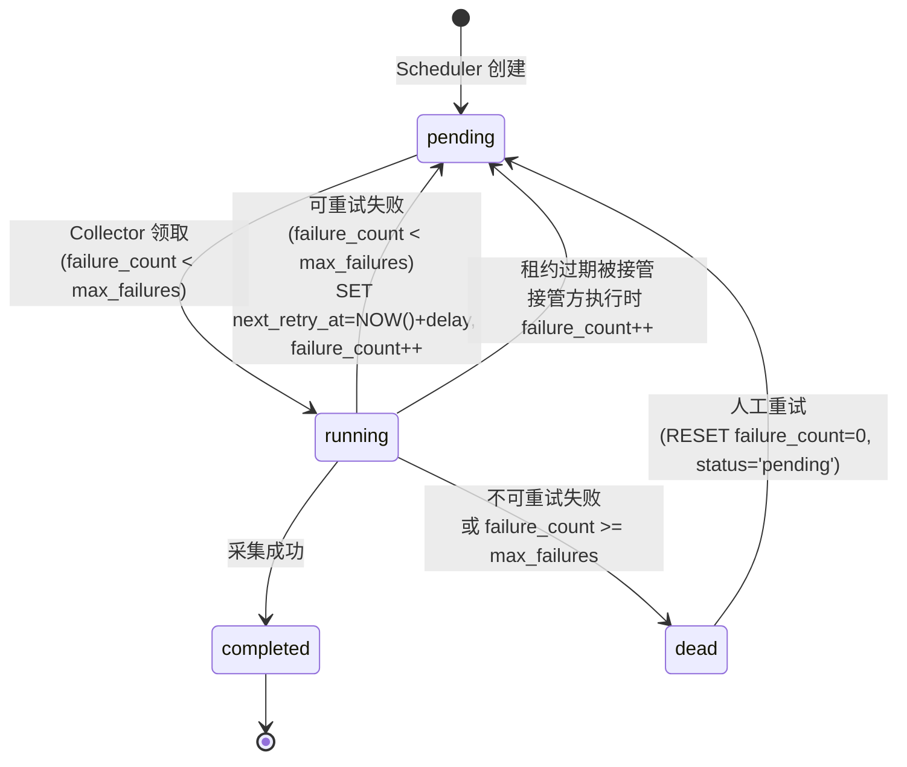

**状态定义**：

| 状态 | 含义 | 谁转换 |
|------|------|--------|
| `pending` | 等待领取 | Scheduler 创建；失败后重置；租约过期后接管；计划缩容释放 |
| `running` | 正在执行 | Collector 领取时设置 |
| `completed` | 成功完成 | Collector 完成后设置 |
| `failed` | **已废弃**（由 `dead` 替代，保留值仅兼容旧数据） | 不再使用 |
| `dead` | 不可重试的失败（failure_count >= max_failures 或致命错误） | Collector 或 pre-claim 清理 |

##### dedupe_key 设计

`dedupe_key` 用于防止 Scheduler 在同一时间窗口内重复创建任务。

**问题**：普通 `UNIQUE KEY` 会让 `completed`/`dead` 的旧行也阻止新任务创建。

**方案**：`dedupe_key` 由 **Scheduler 单方生成**（格式 `{task_type}:{source_id}:{window_start}`），数据库侧只做活跃任务唯一约束，不再从 `task_params` 二次推导：

```sql
-- Scheduler 写入时：
-- dedupe_key = 'ci_sync:schedule_nightly_test_a2:2026-07-28T10:00'

-- 表定义：
dedupe_key VARCHAR(255) NOT NULL,
active_dedupe_key VARCHAR(255)
  GENERATED ALWAYS AS (
    CASE WHEN status IN ('pending', 'running') THEN dedupe_key ELSE NULL END
  ) STORED,
UNIQUE INDEX uk_active_dedupe (active_dedupe_key)
```

Scheduler 插入前校验：

```python
if not dedupe_key:
    raise ValueError("dedupe_key must not be empty")
```

`completed`/`dead` 行对应的 `active_dedupe_key` 为 `NULL`，不参与唯一约束。

**人工重跑**：不创建新任务，直接复用原行：

```sql
UPDATE collection_tasks
SET status = 'pending',
    execution_count = 0,
    failure_count = 0,
    next_retry_at = NULL,
    last_error = NULL
WHERE id = :task_id;  -- lease_generation 不清零
```

**备份删除**：Scheduler 应定期清理旧任务：

```sql
DELETE FROM collection_tasks
WHERE status IN ('completed', 'dead')
  AND updated_at < NOW() - INTERVAL 30 DAY;
```

##### Reaper（兜底清理，可选）

```sql
-- Reaper 每 30s 执行一次（可选，pre-claim 清理已覆盖核心场景）
UPDATE collection_tasks
SET lease_owner = NULL,
    lease_token = NULL,
    lease_expiry = NULL,
    next_retry_at = CASE
        WHEN failure_count >= max_failures THEN NULL
        ELSE NOW() + INTERVAL 1 MINUTE
    END,
    status = CASE
        WHEN failure_count >= max_failures THEN 'dead'
        ELSE 'pending'
    END
WHERE status = 'running'
  AND lease_expiry < NOW();
```

注意：**推荐优先使用领取 SQL 中的 `running + expired` 直接接管**，Reaper 在 Collector 数量较多（> 10）时再引入以减少主路径复杂度。

##### 续约、检查点、完成都必须携带 token

仅检查 `lease_owner` 不够——进程重启后会复用相同名称。必须用 `lease_token` 做 fencing：

```sql
-- 续约（每 20s）
UPDATE collection_tasks
SET lease_expiry = NOW() + INTERVAL 60 SECOND
WHERE id = :task_id
  AND lease_owner = :owner
  AND lease_token = :token       -- fencing token
  AND lease_expiry > NOW();      -- 租约已过期则拒绝

-- 写检查点
UPDATE collection_tasks
SET checkpoint_data = :checkpoint
WHERE id = :task_id
  AND lease_owner = :owner
  AND lease_token = :token
  AND lease_expiry > NOW();

-- 完成任务
UPDATE collection_tasks
SET status = 'completed',
    lease_owner = NULL,
    lease_token = NULL,
    lease_expiry = NULL
WHERE id = :task_id
  AND lease_owner = :owner
  AND lease_token = :token
  AND lease_expiry > NOW();
```

##### Fencing token 保护的场景

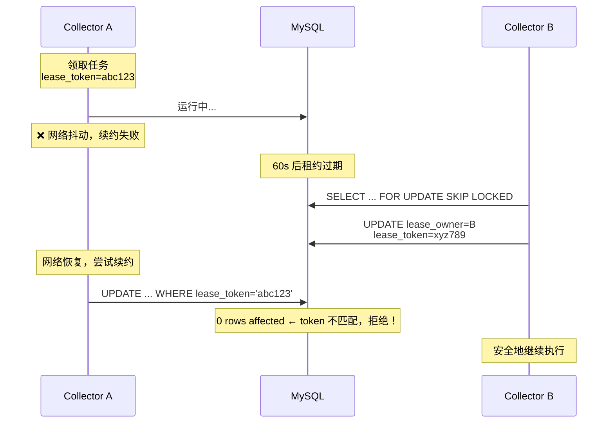

##### 业务数据写入的 fencing 保护

`lease_token` 只保护了任务表（续约、检查点、完成）。**Collector 写 telemetry_db 时也必须验证仍持有租约**，否则旧 Collector 可能用过期数据覆盖新 Collector 的写入结果。

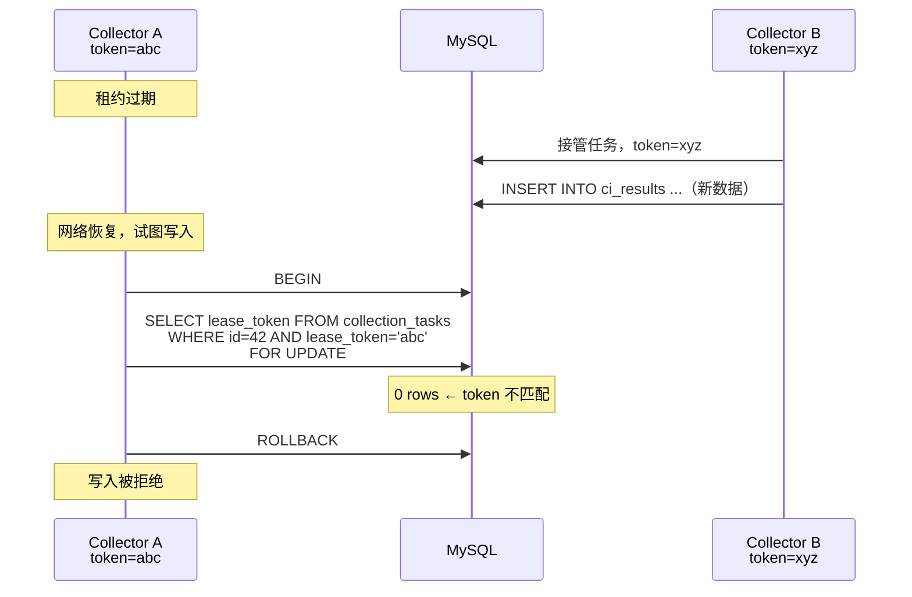

**每个批次的写入模式**：

```sql
BEGIN;

-- 1. 验证仍持有租约
SELECT lease_token
FROM collection_tasks
WHERE id = :task_id
  AND lease_owner = :owner
  AND lease_token = :token
  AND lease_expiry > NOW()
FOR UPDATE;

-- 2. 如果上一步无结果（租约已失效），ROLLBACK 并停止

-- 3. 写入采集结果（幂等）
INSERT INTO ci_results (...)
VALUES (...)
ON DUPLICATE KEY UPDATE
    status     = VALUES(status),
    conclusion = VALUES(conclusion),
    updated_at = NOW();

-- 4. 同一事务更新检查点
UPDATE collection_tasks
SET checkpoint_data = :checkpoint
WHERE id = :task_id
  AND lease_token = :token;

COMMIT;
```

如果单批次数据量太大无法放在一个事务里，业务表应额外记录 `task_id` + `_lease_generation`，更新时拒绝旧代数覆盖新代数：

```sql
-- 业务表的 fencing 字段
ALTER TABLE ci_results ADD COLUMN _task_id BIGINT;
ALTER TABLE ci_results ADD COLUMN _lease_generation BIGINT DEFAULT 0;

-- MySQL 8.0.20+：VALUES() 已弃用，改用行别名
INSERT INTO ci_results (id, status, conclusion, _task_id, _lease_generation)
VALUES (:id, :status, :conclusion, :task_id, :generation) AS new
ON DUPLICATE KEY UPDATE
    status = IF(new._lease_generation >= ci_results._lease_generation,
                new.status, ci_results.status),
    conclusion = IF(new._lease_generation >= ci_results._lease_generation,
                    new.conclusion, ci_results.conclusion),
    _lease_generation = GREATEST(new._lease_generation, ci_results._lease_generation);
```

> 所有会被更新的业务字段都使用相同的 `_lease_generation` 条件，不只保护 `status`。

**幂等防止"重复行"，fencing 防止"旧数据覆盖新数据"，两者缺一不可。**

##### 异构 Collector 的能力过滤

```sql
-- Python Collector 启动参数
-- --capabilities python

-- C++ Worker 启动参数
-- --capabilities cpp

-- 领取时（参数化，不是硬编码）：
AND (required_capability IS NULL
     OR required_capability IN (:worker_capabilities))
```

Scheduler 创建任务时设置 `required_capability`，Collector 领取时自动过滤。

##### 租约协议时序

```mermaid
sequenceDiagram
    participant C as Collector
    participant DB as MySQL

    loop 每 5 秒（空闲时）
        C->>DB: BEGIN;<br/>SELECT ... FOR UPDATE SKIP LOCKED;<br/>UPDATE ... SET lease_token=:app_generated_token;<br/>COMMIT;
        alt 领取成功
            Note over C: 获得 task + lease_token
            loop 每 20 秒
                C->>DB: UPDATE ... SET lease_expiry=NOW()+60<br/>WHERE lease_token=:token AND lease_expiry > NOW()
                alt affected_rows = 1
                    Note over C: 续约成功
                else affected_rows = 0
                    Note over C: token 失效，停止执行
                end
            end
            C->>DB: 写入采集数据（幂等）
            C->>DB: UPDATE ... SET status='completed'<br/>WHERE lease_token=:token
        else 无可用任务
            Note over C: sleep 5s
        end
    end
```

##### 幂等键定义

| 数据类型 | 幂等键 | 实现 |
|---------|--------|------|
| CI workflow runs | `(workflow_name, run_id)` | `INSERT ... ON DUPLICATE KEY UPDATE` |
| CI jobs | `(run_id, job_name)` | 同上 |
| 性能测试 | `(test_name, hardware, model, version, timestamp)` | 同上 |
| 模型报告 | `(model_config_id, workflow_run_id)` | 同上 |
| NPU 指标 | `(node_name, metric_time)` | 同上 |

##### 安全措施

- 新增表 + 新增 UNIQUE KEY，不影响现有数据
- `lease_token` 用 UUID，每次领取重新生成
- 所有写操作（续约、检查点、完成）必须携带 `lease_token`

---

#### Step 5：同镜像多 command

**做什么**：同一个 OCI 镜像，通过不同启动命令运行不同角色。

默认生产配置使用：

```env
IMAGE_REGISTRY=ghcr.io/meng
VERSION=2026.07.27-1
```

如启用自建缓存，只覆盖 `IMAGE_REGISTRY=registry.internal:5000/meng`，Compose和发布脚本不写死具体Registry。

```
${IMAGE_REGISTRY}/vllm-dashboard:${VERSION}

  ├─ python -m api.main           → API 服务
  ├─ python -m scheduler       → 调度器
  ├─ python -m collector       → 采集器
  └─ python database/migrations/mysql_schema.py  → 数据库迁移
```

**docker-compose.prod.yml 改法**：

> **说明**：普通 `docker compose` 不支持跨节点调度 `deploy.replicas`。多节点部署采用按角色组合的 Compose 文件，由 Inventory 指定节点角色，再由 Ansible/SSH 或 CI 推送。详见 [附录：多节点 Compose 文件结构](#附录多节点-compose-文件结构)。

```yaml
# compose.control.yml
services:
  api:
    image: ghcr.io/meng/vllm-dashboard:${VERSION}
    command: python -m api.main
    # ...

  scheduler:
    image: ghcr.io/meng/vllm-dashboard:${VERSION}
    command: python -m scheduler
    # ...

# compose.collector.yml + compose.query.yml
services:
  collector:
    image: ghcr.io/meng/vllm-dashboard:${VERSION}
    command: python -m collector
    # ...

  query:
    image: ghcr.io/meng/vllm-dashboard:${VERSION}
    command: python -m app.query
    # ...
```

---

#### Step 6：预构建镜像

##### 什么是镜像仓库

类比：

```
GitHub = 存代码的地方   →  git push / git pull
镜像仓库 = 存镜像的地方  →  docker push / docker pull
```

镜像仓库里存的是已经编译好的 Docker 镜像（包含所有依赖、二进制、运行环境）。任何机器只需要 `docker pull` 就能拿到完全一致的运行环境，不需要安装编译工具。

##### 当前 vs 目标

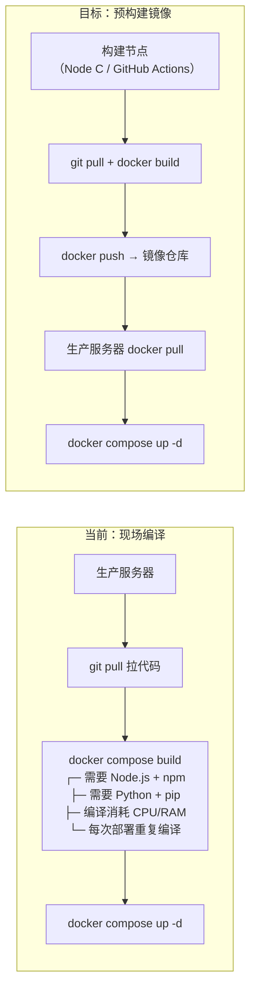

**为什么要改**：

| 维度 | 现场编译 | 预构建镜像 |
|------|---------|-----------|
| 生产环境依赖 | 需要 Node.js、Python、pip、npm | 只需要 Docker |
| 部署耗时 | 编译 3~8 分钟 | pull 10~30 秒 |
| 环境一致性 | 可能因 pip/npm 版本不同产生差异 | 同一镜像，完全一致 |
| 回滚速度 | 需要重新编译旧版代码 | `docker pull` 旧 tag，秒级 |
| 故障排查 | "生产环境编译失败" 难复现 | 编译在构建节点完成，日志可查 |

##### 镜像仓库选型

| 方案 | 地址示例 | 费用 | 国内速度 | 维护成本 | 公网依赖 |
|------|---------|------|---------|---------|---------|
| **GitHub Container Registry** | `ghcr.io/meng/vllm-dashboard` | 免费（公开仓库） | 较慢（数 MB/s） | 零 | 需要 |
| **阿里云 ACR** | `registry.cn-hangzhou.aliyuncs.com/meng/vllm-dashboard` | 按存储+流量，约几十元/月 | 快（同区内网） | 零 | 需要 |
| **自建 Registry** | `registry.internal:5000/vllm-dashboard` | 免费（自己的机器） | 极快（Tailscale 私网） | 需要维护 | 不需要 |

##### 推荐方案：GitHub Container Registry（主）+ 自建缓存（可选）

```mermaid
flowchart TB
    subgraph BUILD["构建阶段"]
        GIT["Git Push"] --> CI["GitHub Actions<br/>或 Node C"]
        CI --> BUILD["docker build -t vllm-dashboard:2026.07.27-1 ."]
        BUILD --> TEST["冒烟测试<br/>起临时容器验证"]
        TEST --> PUSH_GHCR["docker push<br/>ghcr.io/meng/vllm-dashboard:2026.07.27-1"]
    end

    subgraph DEPLOY["部署阶段"]
        PUSH_GHCR --> PULL["生产服务器<br/>docker pull"]
        PULL --> UP["docker compose up -d"]
    end

    subgraph CACHE["可选：国内缓存加速"]
        GHCR["ghcr.io"] -.->|"网络慢时<br/>手动或定时同步"| LOCAL["registry.internal:5000<br/>自建 Registry<br/>跑在 Tailscale 私网内"]
        LOCAL -.->|"内网极速拉取"| PULL
    end
```

**为什么推荐 GitHub Container Registry 作为主仓库**：

1. 代码在 GitHub，镜像也在 GitHub，配置最简单
2. 公开仓库免费，私有仓库也有免费额度
3. GitHub Actions 原生支持，推送只需一行 `docker push`
4. 不需要额外申请云服务、不需要信用卡

**什么时候加自建缓存**：当从 `ghcr.io` pull 镜像确实太慢（> 2 分钟），在 Node A 上跑一个 registry mirror：

```bash
# 在 Node A 上启动 registry mirror
docker run -d --name registry-mirror \
  --restart=always \
  -p 5000:5000 \
  -e REGISTRY_PROXY_REMOTEURL=https://ghcr.io \
  registry:2

# 生产服务器 pull 时走 mirror
docker pull registry.internal:5000/meng/vllm-dashboard:2026.07.27-1
```

##### 镜像版本号规范

```
{service}-{date}-{build}

control-service:2026.07.27-1
query-service:2026.07.27-1
collector:2026.07.27-3
frontend:2026.07.27-1
```

- `date`：构建日期，一眼看出新旧
- `build`：当天第几次构建（同一天有修补时递增）
- 额外打一个 `latest` tag 指向当前生产版本（仅作参考，部署时永远用具体版本号）

##### docker-compose.prod.yml 改动

```yaml
# 旧：现场编译
services:
  backend:
    build:
      context: ./backend
      dockerfile: Dockerfile.prod

# 新：预构建镜像
services:
  backend:
    image: ghcr.io/meng/vllm-dashboard:${VERSION}
    # build 指令可以保留用于本地开发，生产部署时忽略
```

##### deploy_prod.sh 改动

```bash
# 旧 Step 4：现场编译
step "4/9 Build new images"
compose build backend frontend

# 新 Step 4：拉取镜像
step "4/9 Pull pre-built images"
docker pull "${IMAGE_REGISTRY}/vllm-dashboard:${VERSION}"
# 验证镜像完整性（拉取成功 + sha256 校验）
docker image inspect "${IMAGE_REGISTRY}/vllm-dashboard:${VERSION}" > /dev/null
```

##### 安全措施

```
□ 构建完成后，在构建节点起一个临时容器，访问 /health 通过后再 push
□ 镜像 tag 使用日期 + 序号，永远不用 :latest 部署
□ 推送后记录 sha256 digest，部署时校验
□ .env.production 中的 VERSION 变量指定具体版本号，不自动拉取最新
```

---

#### Step 7：Tailscale 私网 + db.internal

**做什么**：
- 当前只有生产节点时先统一使用 `db.internal` 逻辑地址；出现新增节点后，所有标准节点安装 Tailscale 并加入同一个 tailnet
- 数据库地址从 `mysql:3306`（Docker 网络内部）改为 `db.internal:3306`（自建内部 DNS，TTL 30s）
- 所有服务间通信走 Tailscale 加密通道

`db.internal` 从单机阶段就使用，初始指向 `190.92.220.4`；节点扩展或主库切换时只改变解析，不修改应用配置。没有额外节点时，本步骤的Tailscale多节点部分可以延后，但数据库逻辑地址不能继续写死为Compose服务名。

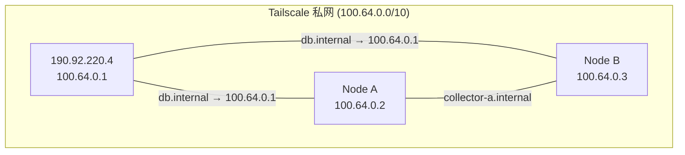

**安全措施**：

- Tailscale 提供节点间链路加密（WireGuard）。应用层是否额外使用 TLS 取决于合规要求和代理链路。内部服务间通信在 Tailscale 私网内可以不做应用层 TLS。
- **必须配置 Tailscale ACL**：

```jsonc
// Tailscale ACL 最小规则
{
  "acls": [
    // MySQL 只允许特定服务节点
    {"action": "accept", "src": ["tag:control", "tag:collector", "tag:query", "tag:scheduler"],
     "dst": ["tag:mysql:3306"]},
    // Ingress Nginx → 后端服务
    {"action": "accept", "src": ["tag:ingress"], "dst": ["tag:control:8001", "tag:query:8000"]},
    // Registry 只允许部署节点
    {"action": "accept", "src": ["tag:deploy"], "dst": ["tag:registry:5000"]},
    // 管理员
    {"action": "accept", "src": ["autogroup:admin"], "dst": ["*:*"]}
  ]
}
```

- MySQL 容器使用 Docker bridge 网络时，Tailscale IP 在宿主机上，容器内无法直接绑定。推荐方式：

```yaml
# docker-compose 中通过端口映射限制监听范围
services:
  mysql:
    ports:
      - "100.64.0.1:3306:3306"  # 只发布到 Tailscale IP
    # 容器内 bind-address = 0.0.0.0，但宿主机只把 Tailscale IP 的 3306 暴露出去
```

另一种方式是 `network_mode: host`，但需要明确选择并了解其对网络隔离的影响。
- SSH 与管理通道与业务流量分开（Tailscale SSH 或独立 SSH bastion）
- Tailscale auth key 使用一次性、短有效期、带 tag 的 key

---

#### Step 8：建立数据所有权边界，按需拆分逻辑数据库

##### 前提

三个逻辑 Schema 运行在同一个 MySQL 实例时，获得的是**所有权、权限和迁移边界**，不会获得 CPU、内存、磁盘或故障隔离。因此不应只为架构图整齐而一次性移动全部历史表。

默认采用渐进策略：

1. 先建立 `control_svc`、`scheduler_svc`、`collector_svc`、`query_svc` 独立账户和访问矩阵。
2. 所有新表直接创建在目标 Schema。
3. 代码通过独立 `CONTROL_DATABASE_URL`、`COLLECTION_DATABASE_URL`、`TELEMETRY_DATABASE_URL` 访问；第一阶段三个 URL 可以指向同一实例。
4. 旧表只有在所有权、权限或未来物理拆库确有收益时才迁移。
5. 在大规模迁移前，必须已经存在 Step 0.5 的健康 Replica，并在隔离恢复库完成预演。

若评审后决定一次性迁移旧表，才使用下面的短维护窗口方案。`RENAME TABLE` 是**原子移动**，不是复制；执行后旧库中的表就不存在了，因此"24 小时双写"或"保留旧表观察"不适用于该方案。

对当前数据规模（预计 < 10GB），可选方案为**短维护窗口 + RENAME TABLE + 兼容 View**。以下技术细节作为经过测试后才能执行的迁移 Runbook 保留。

##### 表分类

```
MySQL 实例
├─ control_db           ← users, model_configs, workflow_configs,
│                         alert_rules, system_configs, user_login_logs,
│                         token_blacklist, daily_report_history, llm_provider_configs
│
├─ collection_db        ← collection_tasks, job_owners, model_sync_configs,
│                         kubernetes_cluster_configs, project_dashboard_config
│
└─ telemetry_db         ← ci_results, ci_jobs, performance_data, model_reports,
                          resource_npu_metrics, resource_node_metrics,
                          daily_summaries, daily_prs, daily_issues, daily_commits,
                          daily_failure_records, job_failure_analysis,
                          issue_diagnosis_history, nightly_test_cases,
                          model_registry, model_feature_matrix, feature_compatibility,
                          code_metrics_*, test_cases, test_runs, test_suite_snapshots,
                          analysis_memories, analysis_embeddings,
                          app_logs, feature_usage_logs, pull_requests
```

##### 迁移前检查

不仅要查外键，还要排查所有引用旧库名的地方：

```
□ FK 依赖审计：确认没有跨库外键；有 FK 关系的父子表必须放在同一个目标 Schema 中
□ **Trigger 扫描**：有 Trigger 的表无法 RENAME TABLE 到其他库
  → 记录 Trigger 定义 → DROP TRIGGER → RENAME TABLE → 在新库重建
  → 迁移后验证 Trigger 数量相等、DEFINER 账号存在
□ View / Event / Procedure 中的库名引用
□ SQLAlchemy model 中硬编码的 schema
□ 数据库账号权限（迁移后需更新）
□ 备份脚本中的库名
□ 报表 SQL 中的库名
□ 初始化脚本中的库名
□ 测试代码中的库名
□ collector / scheduler / query 的数据库连接配置
```

##### 完整停机步骤

`RENAME TABLE` 要求目标表没有被任何会话持有锁。**仅停止 Control API 不够**——Scheduler、Collector 的租约续约、采集写入、检查点更新都会持有表锁。

```bash
# 1. Nginx 将所有写接口置为维护状态（返回 503）
# 2. 停止 Scheduler 容器
docker stop vllm-dashboard-scheduler

# 3. 所有 Collector 进入 drain 并停止
for node in node-a node-b; do
    ssh $node "docker stop --time=300 vllm-collector"
done

# 4. 确认所有 running 任务已完成或暂停
mysql -e "SELECT COUNT(*) FROM collection_tasks WHERE status='running'"
# 应为 0

# 5. 停止 Control API + Query（Query 长查询也持有 Metadata Lock）
docker stop vllm-dashboard-control vllm-dashboard-query

# 6. 暂停定时备份、binlog 归档 cron
# 7. 检查残留会话和锁
mysql -e "
  SELECT * FROM information_schema.innodb_trx;
  SELECT * FROM performance_schema.metadata_locks
   WHERE OBJECT_SCHEMA = 'vllm_dashboard';
"

# 8. 关闭应用数据库连接池
sleep 5

# 9. 现在可以安全执行 RENAME TABLE
```

##### 迁移步骤（维护窗口内执行）

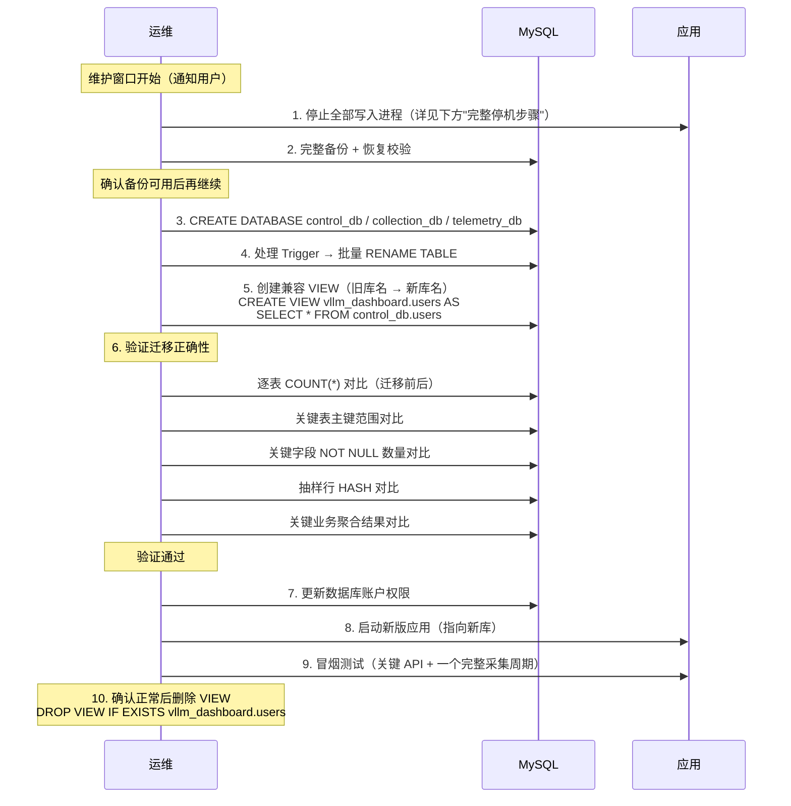

##### 兼容 View（回滚保险）

```sql
-- control_db 的表在旧库创建 VIEW，防旧版应用回滚需要
CREATE VIEW vllm_dashboard.users            AS SELECT * FROM control_db.users;
CREATE VIEW vllm_dashboard.model_configs    AS SELECT * FROM control_db.model_configs;
-- ... 其余表同理
```

**注意**：MySQL View 对写入的支持有限（不能涉及 JOIN、GROUP BY、DISTINCT 等）。用于回滚期间的临时兼容可以，但不应作为长期方案。新版应用稳定后应立即删除 VIEW。

##### 回滚方案

**注意**：迁移后旧库中存在兼容 VIEW（如 `vllm_dashboard.users` → `control_db.users`）。直接 `RENAME TABLE` 回去会因同名 VIEW 冲突而失败。

正确顺序：

```bash
# 1. 进入维护窗口，停止全部写入
# 2. DROP VIEW 清理旧 Schema 下的兼容 VIEW
mysql -e "DROP VIEW IF EXISTS vllm_dashboard.users;"
mysql -e "DROP VIEW IF EXISTS vllm_dashboard.model_configs;"
# ... 全部 VIEW

# 3. RENAME TABLE 移回旧 Schema
mysql -e "RENAME TABLE control_db.users TO vllm_dashboard.users;"
# ... 全部表

# 4. DROP DATABASE control_db; DROP DATABASE collection_db; DROP DATABASE telemetry_db;
# 5. 恢复旧版数据库账户权限
# 6. 启动拆分前的应用版本
# 7. 验证
```

##### 批量原子 RENAME

逐表 RENAME 会导致部分成功、部分失败的状态。MySQL 支持一条语句移动多表，**整条语句失败时不产生任何修改**：

```sql
-- 一条原子语句移动全部表（或按依赖组拆分）
RENAME TABLE
    vllm_dashboard.users                  TO control_db.users,
    vllm_dashboard.model_configs          TO control_db.model_configs,
    vllm_dashboard.workflow_configs       TO control_db.workflow_configs,
    -- ... control_db 其余表
    vllm_dashboard.collection_tasks       TO collection_db.collection_tasks,
    vllm_dashboard.job_owners             TO collection_db.job_owners,
    -- ... collection_db 其余表
    vllm_dashboard.ci_results             TO telemetry_db.ci_results,
    vllm_dashboard.ci_jobs                TO telemetry_db.ci_jobs,
    -- ... telemetry_db 其余表
;
```

**Trigger 处理**（RENAME TABLE 前执行）：

```sql
-- 1. 扫描所有 Trigger
SELECT TRIGGER_NAME, EVENT_OBJECT_TABLE, ACTION_STATEMENT, DEFINER
FROM information_schema.TRIGGERS
WHERE TRIGGER_SCHEMA = 'vllm_dashboard';

-- 2. 记录定义 → DROP
DROP TRIGGER IF EXISTS vllm_dashboard.trigger_name;

-- 3. RENAME TABLE ...

-- 4. 在新库重建 Trigger（调整 DEFINER 和库名引用）
CREATE TRIGGER control_db.trigger_name ...;
```

##### 验证标准

`COUNT(*)` 不足以验证迁移正确性。至少还应：

```
□ 逐表 COUNT(*) = 迁移前
□ 关键表主键 MIN/MAX 范围一致
□ 关键字段（user.username, ci_results.run_id 等）NOT NULL 计数一致
□ 抽样 100 行 MD5(CONCAT_WS(...)) 对比
□ 关键业务聚合（如 "每个 workflow 的 run 总数"）结果一致
```

##### 安全措施总结

1. **迁移前**：完整备份 + 恢复校验 + 全部引用排查
2. **迁移中**：维护窗口停写 + RENAME TABLE（原子）+ 兼容 VIEW
3. **迁移后**：新版应用 + 多重验证 + 冒烟测试 + 确认后删 VIEW
4. **回滚**：RENAME TABLE 移回 + 应用回滚

---

#### Step 9：多 Collector 部署

**验证清单**：
```
□ 2 个 Collector 同时运行，各自领取不同任务（不冲突）
□ 1 个 Collector 宕机后，另一个在 65 秒内接管（租约过期 + 轮询）
□ 优雅退出：SIGTERM → 完成当前批次 → 写检查点 → 释放租约
□ 幂等写入：同一任务被重复执行后不产生重复数据
□ 续约正常：租约过期前成功续约
```

**SIGTERM Handler 关键逻辑**（见 [4.3 Collector 优雅退出](#43-collector-优雅退出sighandler)）。

---

#### Step 10：在首个 Replica 已建立时增加第二个 Replica

第一个 Replica 应已在 Step 0.5 建立并用于迁移预演；本步骤增加位于不同故障域的第二副本。如果Step 0.5因当时没有新增节点而被跳过，则先执行Step 0.5，本步骤不单独创建“第二个”副本。两个副本不得仅仅位于同一台物理机的不同虚拟机中，否则不能视为两份容灾副本。

binlog + GTID 已在 Phase 0 开启，此处只部署副本。

**前提**：
- Primary 已开启 binlog（ROW）+ GTID（Phase 0.2）
- Step 0.5 的首个 Replica 已健康运行并通过恢复验证
- Node A 和 Node B 已加入 Tailscale 私网（Step 7）
- Node A 和 Node B 的 MySQL 容器已安装（同版本 8.0）

**每个副本必须配置**：
```ini
# Node A 的 mysql.cnf
server_id = 2              # Node B 用 3，必须唯一
read_only = ON
super_read_only = ON
log_replica_updates = ON   # 该副本未来可能被提升为主库
```

**部署步骤**：

1. 从 Primary 做 `mysqldump --source-data=2 --single-transaction`
2. 恢复到 Node A / Node B
3. `CHANGE REPLICATION SOURCE TO SOURCE_HOST='...', SOURCE_AUTO_POSITION=1; START REPLICA;`
4. 验证 `Seconds_Behind_Source = 0`，`Replica_IO_Running = Yes`，`Replica_SQL_Running = Yes`
5. 主库和副本各逐表 COUNT 对比

**副本就绪后**：
- 备份脚本改为从副本执行 `mysqldump`（降低 Primary I/O 压力，同时实现异地备份）
- Query 逐步切换读流量到副本（见 [5.4 读写一致性策略](#54-读写一致性策略)）

---

#### Step 11：主备切换脚本 + 故障演练

主备切换 SOP 详见 [5.3 MySQL 主备切换 SOP](#53-mysql-主备切换-sop)。

**演练场景**：
```
□ kill Collector 进程 → 租约过期后其他节点接管（≤ 65s），数据不丢不重
□ kill Scheduler → Collector 继续运行，无新任务，重启后恢复
□ kill Query 实例 → Nginx 自动切到其他实例
□ kill Control 实例 → Nginx 自动切换到另一实例
□ kill MySQL Primary → 执行 promote_replica.sh，验证 RTO/RPO
□ kill 一个 Replica → 应用自动切到另一个 Replica
```

每次演练记录实际 RTO 和数据完整性校验结果，更新故障矩阵。

---

#### Step 12：Profiling → C++ Worker（按需，不阻塞容灾）

**触发条件**：对 Python Collector 做完整链路 profiling，确认以下任一瓶颈：
- 大文件解析耗时 > 总采集时间的 30%
- JSON 反序列化 CPU 占用 > 50%
- 批量数据转换阻塞其他任务

**如果引入**：
```
C++ Worker = 独立容器 + 独立镜像
- 从 collection_db 领取 required_capability='cpp' 的任务
- 遵循相同的租约/检查点/幂等协议（含 lease_token fencing）
- 输出写入 telemetry_db
```

---

### 2.3 数据库职责分离的渐进策略

#### 2.3.1 问题：MySQL 身兼六职

当前 MySQL 同时承担：

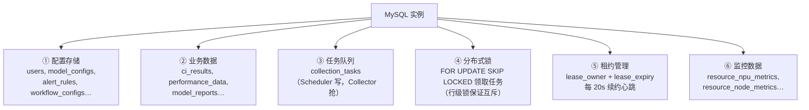

**规模较小时完全够用**。MySQL 8.0 + InnoDB 在几百 QPS 下表现稳定。但随着节点和 Collector 增多，混合负载会互相干扰：

| 问题 | 根因 | 表现 |
|------|------|------|
| 心跳压力 | N 个 Collector × 每 20s 续约 = `N/20` QPS 写 | 10 个 Collector = 持续 0.5 QPS 写，可忽略 |
| 轮询压力 | N 个 Collector × 每 5s 查询 = `N/5` QPS 读 | 10 个 Collector = 2 QPS 读，也可忽略 |
| 混合负载冲突 | OLTP（任务领取）+ OLAP（看板统计）同一实例 | 大查询拖慢小事务 |
| 监控数据膨胀 | NPU 指标秒级写入，千万级行 | 历史查询变慢 |

**结论**：3~5 个 Collector 的规模下 MySQL 完全撑得住。问题出在远期——当 telemetry_db 涨到几十 GB，或者 Collector 数量到几十个时。

#### 2.3.2 渐进式拆分路径

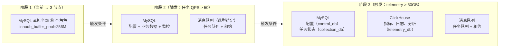

**阶段 1：MySQL 全承担（当前方案，保持）**

不需要引入任何新组件。重点做监控，为后续决策提供数据：

```sql
-- 定期采集，观察趋势
SELECT
    TABLE_SCHEMA,
    SUM(DATA_LENGTH + INDEX_LENGTH) / 1024 / 1024 AS size_mb,
    SUM(TABLE_ROWS) AS total_rows
FROM information_schema.TABLES
WHERE TABLE_SCHEMA IN ('control_db', 'collection_db', 'telemetry_db')
GROUP BY TABLE_SCHEMA;

-- 监控慢查询
-- slow_query_log 已开启，定期检查 /var/log/mysql/slow.log

-- 监控连接数
SHOW STATUS LIKE 'Threads_connected';
```

**阶段 2 的触发条件（量化）**：

| 指标 | 阈值 | 说明 |
|------|------|------|
| 慢查询数 / 小时 | > 10 | 来自 `slow_query_log` |
| `Threads_connected` 峰值 | > 50 | 当前 `max_connections=200` |
| Collector 实例数 | > 10 | 当前预留了 200 connections |
| 任务领取异常率 | > 5% | 存在能力匹配的 runnable 任务时，领取 SQL 返回空的比例；同时记录租约续约失败、fencing 拒绝和过期接管次数 |

**阶段 2 怎么做——如果拆出消息队列**：

> 具体选型（Redis Streams / RabbitMQ / 继续用 MySQL）在触发条件满足时单独设计。不同系统的消息确认、重投递、死信和消费语义差异很大，不是简单替换。以下仅示意 Redis Streams 方案（Consumer Group + ACK + pending reclaim），不代表已选定。

```
应用层先抽象接口（TaskQueue、LeaseManager）：
  ├─ 阶段 1：MySQL 实现
  └─ 阶段 2：消息队列实现（具体选型待定）

MySQL 始终保留一份任务持久化记录：
  └─ 用于消息队列故障后的任务状态恢复
```

**阶段 3 的触发条件（量化）**：

| 指标 | 阈值 |
|------|------|
| telemetry_db 总大小 | > 50 GB |
| 单表行数 | > 5000 万 |
| 分析查询 P99 延迟 | > 2 秒 |
| `innodb_buffer_pool` 命中率 | < 95% |

**阶段 3 怎么做——ClickHouse 接管 telemetry_db**：

```
MySQL 保留：
  ├─ control_db（用户、权限、配置）
  └─ collection_db（任务、租约、检查点）

ClickHouse 接管：
  ├─ ci_results, ci_jobs
  ├─ performance_data
  ├─ resource_npu_metrics, resource_node_metrics
  ├─ model_reports, nightly_test_cases
  ├─ code_metrics_*, test_cases, test_runs
  └─ app_logs, daily_summaries, daily_prs/commits/issues

Query API 改动：
  → 分析查询走 ClickHouse，配置查询走 MySQL
  → 改 DATABASE_URL 为两个连接
```

#### 2.3.3 关键原则

```
1. 不提前拆。每个阶段有量化触发条件，不靠直觉。
2. 拆的时候 MySQL 里留一份任务持久化记录，作为 Redis/Kafka 故障后的恢复源。
3. 应用层先抽象接口（TaskQueue、LockManager、LeaseManager），
   底层从 MySQL 切 Redis 时只改实现，不改调用方。
```

---

## 三、数据安全

### 3.1 当前安全基线（已具备）

| 措施 | 实现 |
|------|------|
| 事务一致性备份 | `mysqldump --single-transaction --quick` |
| 恢复校验 | 备份恢复到 `_verify` 临时库，对比 user count / table count |
| 文件完整性 | SHA256 checksum |
| 部署前自动备份 | `deploy_prod.sh` Step 1 |
| 部署后数量对比 | user/table count 减少 → 自动回滚 |
| 定期备份 | cron 每小时整点 |
| 保留期 | 30 天自动清理 |

### 3.2 架构迁移需要补齐的安全措施

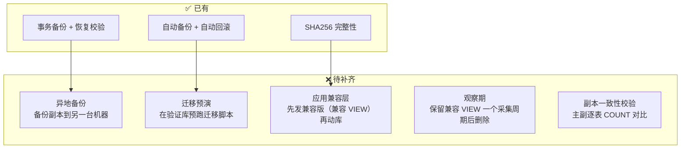

### 3.3 备份策略（拆分后）

数据库拆分后，备份必须覆盖全部三个逻辑库：

```bash
# operations/production/backup.sh — 拆分后的备份命令
mysqldump \
  --databases control_db collection_db telemetry_db \
  --single-transaction \
  --quick \
  --routines \
  --events \
  --triggers \
  --source-data=2 \
  --no-tablespaces \
  > /backups/vllm_dashboard_$(date +%Y%m%d_%H%M%S).sql
```

### 3.4 异地备份

副本就绪后，从副本节点执行备份脚本（天然异地）。备份文件同步到另一节点：

```bash
# cron：每天凌晨 2 点
0 2 * * * rsync -az /backups/ node-b:/data/offsite-backups/
```

### 3.5 迁移安全操作规范

每个高风险步骤（Step 0.2 开启 binlog、Step 8 拆分数据库、Step 10 在首个副本基础上增加第二副本）强制执行：

```
□ 完整备份且恢复校验通过
□ 备份文件已复制到至少 1 台其他机器
□ 迁移脚本在验证库上预跑通过
□ 逐表 COUNT(*) 对比通过
□ 回滚脚本已写好且测试过
□ 应用代码已部署兼容版（指向新库名，兼容 VIEW 回退）
□ 维护窗口已通知
□ 执行后有 ≥ 1 个采集周期的观察期
```

### 3.6 非数据库状态与对象存储

MySQL 容灾完成不代表全部业务状态已经安全。必须扫描 Docker volume、bind mount 和应用生成目录，并按以下规则处理：

| 数据 | 示例 | 目标位置 | 节点丢失后的处理 |
|------|------|---------|-----------------|
| 可重建缓存 | Git 仓库、查询缓存、临时报表 | 节点本地磁盘 | 直接重建 |
| 任务输入 | 原始日志、大型 JSON、C++ Worker 输入 | 对象存储，带生命周期 | 从对象重新执行 |
| 用户业务文件 | 上传、附件、不可再生成报告 | 版本化对象存储 | 恢复指定版本 |
| Secret | `.env`、证书、Token | 独立加密 Secret 包/Secret 系统 | 审计后解密恢复 |

应用只保存对象 URI、校验和和元数据，不把几百 MB 的任务载荷写入 `collection_tasks.payload`。对象接口使用 S3 兼容协议，使底层可以从自建存储迁移到云对象存储而不改变 Worker 协议。

验收：删除任一 API/Collector 节点及其本地 volume 后，不得丢失唯一业务数据；仅允许缓存重建和任务重新执行。

#### 3.6.1 Git 裸镜像缓存与工作树隔离

这里的“Git 裸镜像”是源码对象缓存，不是 Docker 镜像仓库。Collector 在共享
`DATA_DIR/git-mirrors/` 保存 `vllm-ascend`、`vllm` 的 bare repository，每天
04:30 通过持久任务统一刷新分支和 Tag；Scheduler/API 只入队，不直接执行 Git
网络操作。缓存属于节点本地可重建状态，因此 Scheduler 按在线 Collector 的
`node:<NODE_ID>` 能力分别投递刷新任务，不允许只刷新集群中的任意一台。

- 读取单个配置或源码文件时必须使用 `git show <ref>:<path>`，禁止切换共享分支。
- Nightly 配置必须分别读取 `origin/main` 和明确的 `origin/releases/*` Ref。
- 覆盖率、代码指标等必须扫描目录的工具使用按用途隔离的 detached worktree。
- 失败分析使用 `tested_commit`；镜像缺少当天 SHA 时只定向 fetch 对应分支/SHA，
  不刷新整个仓库。
- 定向补充失败时降级为日志、Steps、Artifact 分析并记录源码证据限制，不将任务
  直接置为 `dead`。
- 旧 `DATA_DIR/repos/` clone 仅作为首次迁移的本地种子，确认新镜像和 worktree
  可用后再由运维脚本回收，部署过程不得直接删除。

目录约定：

```text
DATA_DIR/
  git-mirrors/
    vllm-project_vllm-ascend.git/
    vllm-project_vllm.git/
  worktrees/
    vllm-project_vllm-ascend/
      main/
      coverage/
      code-metrics/
    vllm-project_vllm/
      main/
```

---

## 四、节点扩缩容

### 4.1 各服务扩缩容能力

| 服务 | 扩缩容方式 | 中断窗口 | 关键机制 |
|------|-----------|---------|---------|
| **Collector** | 弹性增减实例 | 扩 0 秒 / 缩后 ≤ 65 秒恢复 | `FOR UPDATE SKIP LOCKED` + `lease_token` + 检查点 + 幂等键 |
| **Query** | 先单活/蓝绿，验证分级读后 Active-Active | < 5 秒（健康检查 + 重试窗口） | 无状态 + Nginx upstream + 重型查询降级 |
| **Control** | 先单活/蓝绿，通过无状态验收后 Active-Active | 0 秒 | Scheduler/Migration/本地状态已移出 + Nginx upstream |
| **MySQL Primary** | 不可扩缩 | — | 只有主备切换 |
| **MySQL Replica** | 在线添加/移除 | 0 秒 | `mysqldump --source-data=2` + GTID 自动定位 |

Control 进入 Active-Active 前必须验证：API 不启动 Scheduler、不执行 Migration、不依赖进程内同步进度、不直接操作宿主机 Docker Socket，任意请求落到任意实例结果一致。

#### 4.1.1 标准节点契约

调度与部署层只识别节点能力，不识别 Windows、Linux、云厂商或物理机型号：

```text
标准节点
├─ Linux amd64（第一阶段统一架构）
├─ Docker Engine + Compose
├─ SSH 部署账户
├─ Tailscale 身份与 ACL tag
├─ /srv/vllm-dashboard 标准目录
├─ node_id（全局唯一）
├─ labels（故障域/磁盘/稳定性）
├─ capabilities（可执行任务类型）
└─ limits（CPU/内存/并发上限）
```

Windows 设备通过 Hyper-V Ubuntu Server VM 满足该契约；原生 Linux 直接满足。应用镜像和Worker协议不包含 Windows 路径、PowerShell命令或宿主机专有逻辑。

节点声明示例：

```yaml
node_id: worker-office-a-01
labels:
  zone: office-a
  compute: standard
  storage: ssd
  availability: best-effort
  database_eligible: false
capabilities:
  - python-collector
limits:
  cpu: 2
  memory_mb: 3072
  max_jobs: 1
```

高性能节点可以额外声明 `cpp-log-parser`、`cpp-metrics-aggregate` 等能力。Scheduler 把 `required_capability` 写入任务，Worker 只能领取能力匹配且未超过本机并发限制的任务。

#### 4.1.2 节点加入与退出

加入流程：

```text
安装标准 Linux 环境
→ 安装 Docker / SSH / Tailscale
→ 分配 node_id、ACL tag 和能力标签
→ 恢复该角色所需的最小 Secret
→ 拉取固定 digest 镜像
→ 启动角色 Compose
→ 通过 /health、任务领取和资源检查
→ 加入 Nginx upstream 或 Worker 池
```

退出流程：

```text
从入口摘除 API/Query
→ Collector 进入 drain，不领取新任务
→ 当前任务完成或保存检查点并释放租约
→ 确认节点不持有数据库主角色和唯一备份
→ 停止容器
→ 撤销 Tailscale、数据库和 Registry 凭据
→ 从 Inventory 删除
```

节点突然掉线时不执行优雅退出；任务依赖租约过期自动接管。节点本地唯一文件不允许成为恢复前提。

#### 4.1.3 两级弹性策略

| 阶段 | 节点规模 | 部署控制 | 弹性方式 |
|------|----------|----------|----------|
| Level 1 | 1~3 个计算节点 | Compose + Inventory + Ansible/SSH | 人工加入节点，Worker自动领取任务 |
| Level 2 | 稳定的3~5个以上节点 | 可评估K3s | 自动调度、滚动升级和副本管理 |

Level 1 已实现业务层水平扩展：新增节点后无需修改代码和数据库结构，只需分配角色。Level 2 解决的是部署调度自动化，不改变Control、Query、Collector、任务租约和状态外置的业务架构。

即使未来引入K3s，第一阶段仍将MySQL Primary、Replica和历史备份作为独立有状态服务管理；不因计算调度器上线而立即把数据库迁入集群。

### 4.2 Collector 生命周期

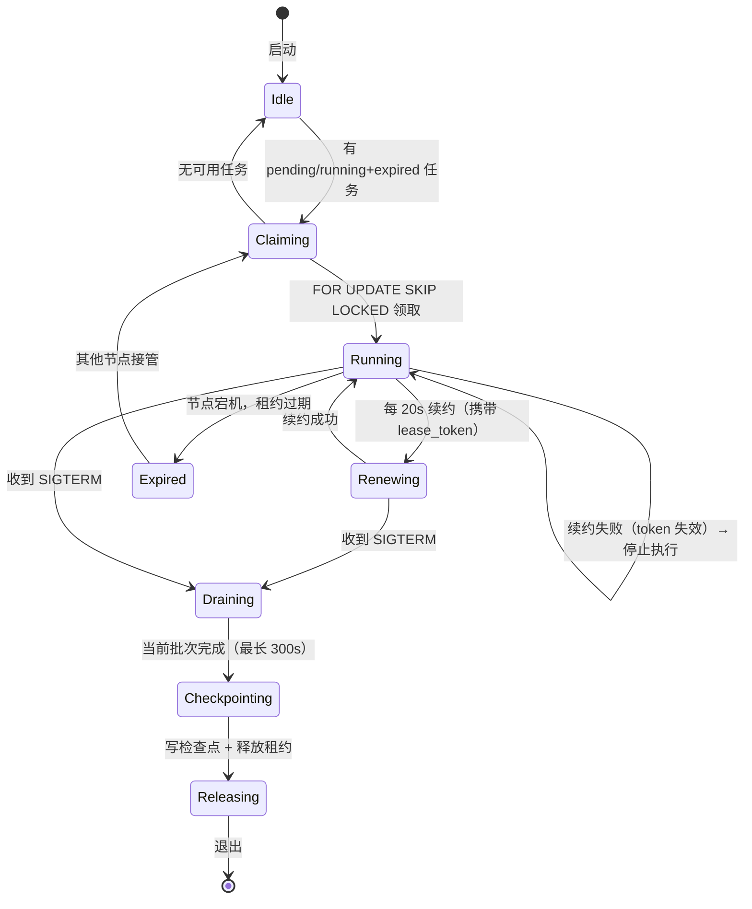

### 4.3 Collector 优雅退出（SIGTERM Handler）

```python
import signal
import asyncio
import uuid

class CollectorWorker:
    def __init__(self, node_id: str, capabilities: list[str], db, max_concurrent: int = 3):
        self.node_id = node_id
        self.capabilities = capabilities
        self.db = db
        self._draining = False
        self._semaphore = asyncio.Semaphore(max_concurrent)
        self._task_contexts: dict[int, TaskContext] = {}  # 业务上下文
        self._futures: dict[int, asyncio.Task] = {}        # 执行 Future

    def _handle_sigterm(self, signum, frame):
        logger.info(f"Received {signal.Signals(signum).name}, entering drain mode")
        self._draining = True

    async def run(self):
        loop = asyncio.get_running_loop()
        if hasattr(loop, 'add_signal_handler'):
            loop.add_signal_handler(signal.SIGTERM, self._handle_sigterm, signal.SIGTERM, None)
            loop.add_signal_handler(signal.SIGINT, self._handle_sigterm, signal.SIGINT, None)
        else:
            signal.signal(signal.SIGTERM, self._handle_sigterm)
            signal.signal(signal.SIGINT, self._handle_sigterm)

        while not self._draining:
            await self._semaphore.acquire()
            task_ctx = await self._claim_task()
            if task_ctx:
                future = asyncio.ensure_future(self._execute_with_lease(task_ctx))
                self._futures[task_ctx.task_id] = future
                self._task_contexts[task_ctx.task_id] = task_ctx
                future.add_done_callback(
                    lambda f, tid=task_ctx.task_id: self._on_task_done(tid, f)
                )
            else:
                self._semaphore.release()
                await asyncio.sleep(5)

        # drain 阶段
        logger.info("Drain mode: %d tasks remaining", len(self._futures))
        try:
            await asyncio.wait_for(
                asyncio.gather(*self._futures.values(), return_exceptions=True),
                timeout=300
            )
        except asyncio.TimeoutError:
            logger.warning("Drain timeout, cancelling remaining tasks")
            futures = list(self._futures.values())
            for f in futures:
                f.cancel()
            # cancel() 只是发送请求，必须再次 await 等待协程退出
            await asyncio.gather(*futures, return_exceptions=True)

        await self._flush_all_checkpoints()
        await self._release_all_leases()
        await self._close_db()
        logger.info("Graceful shutdown complete")

    def _on_task_done(self, task_id: int, future: asyncio.Task):
        """协程完成/异常/取消时清理"""
        self._futures.pop(task_id, None)
        self._task_contexts.pop(task_id, None)
        self._semaphore.release()
        if future.cancelled():
            logger.warning("Task %d was cancelled", task_id)
        else:
            exc = future.exception()
            if exc:
                logger.error("Task %d failed: %s", task_id, exc)

    async def _claim_task(self) -> TaskContext | None:
        lease_token = str(uuid.uuid4())
        async with self.db.begin() as conn:
            await conn.execute(text("""
                UPDATE collection_tasks
                SET status = 'dead', lease_owner = NULL, lease_token = NULL,
                    lease_expiry = NULL, last_error = 'lease expired after max failures'
                WHERE status = 'running' AND lease_expiry < NOW()
                  AND failure_count >= max_failures
            """))

            result = await conn.execute(
                text("""
                    SELECT id FROM collection_tasks
                    WHERE (
                        status = 'pending'
                        OR (status = 'running' AND lease_expiry < NOW())
                    )
                    AND failure_count < max_failures
                    AND (required_capability IS NULL
                         OR required_capability IN :capabilities)
                    AND (next_retry_at IS NULL OR next_retry_at <= NOW())
                    ORDER BY priority DESC, created_at
                    LIMIT 1
                    FOR UPDATE SKIP LOCKED
                """).bindparams(bindparam("capabilities", expanding=True)),
                {"capabilities": tuple(self.capabilities)}
            )
            row = result.fetchone()
            if not row:
                return None
            task_id = row[0]
            await conn.execute(
                text("""
                    UPDATE collection_tasks
                    SET status = 'running',
                        lease_owner = :owner,
                        lease_token = :token,
                        lease_expiry = NOW() + INTERVAL 60 SECOND,
                        lease_generation = lease_generation + 1,
                        execution_count = execution_count + 1,
                        failure_count = CASE
                            WHEN lease_owner IS NOT NULL AND lease_expiry < NOW()
                            THEN failure_count + 1  -- 接管已过期任务，计一次失败
                            ELSE failure_count
                        END
                    WHERE id = :task_id
                """),
                {"owner": self.node_id, "token": lease_token, "task_id": task_id}
            )
            gen_row = await conn.execute(
                text("SELECT lease_generation FROM collection_tasks WHERE id = :id"),
                {"id": task_id}
            )
            lease_generation = gen_row.scalar()

        return TaskContext(task_id=task_id, lease_token=lease_token, lease_generation=lease_generation)

    async def _release_all_leases(self):
        for task_id, ctx in list(self._task_contexts.items()):
            async with self.db.begin() as conn:
                await conn.execute(
                    text("""
                        UPDATE collection_tasks
                        SET status = 'pending',
                            lease_owner = NULL, lease_token = NULL,
                            lease_expiry = NULL, next_retry_at = NOW()
                        WHERE id = :task_id
                          AND lease_owner = :owner
                          AND lease_token = :token
                    """),
                    {"task_id": task_id, "owner": self.node_id, "token": ctx.lease_token}
                )
        self._task_contexts.clear()
```

### 4.4 关键参数

| 参数 | 值 | 说明 |
|------|-----|------|
| `lease_ttl` | 60 秒 | 租约过期时间 |
| `lease_renew_interval` | 20 秒 | 续约间隔（TTL 的 1/3） |
| `task_poll_interval` | 5 秒 | 空闲轮询间隔 |
| `drain_timeout` | 300 秒 | 优雅退出最长等待 |
| `claim_batch_size` | 1 | 当前版本固定单条领取 |
| `max_collector_connections` | 10 | 单 Collector 连接数 |
| `mysql_max_connections` | 200 | 支持 10+ Collector |

---

## 五、容灾

### 5.1 MySQL 容灾拓扑

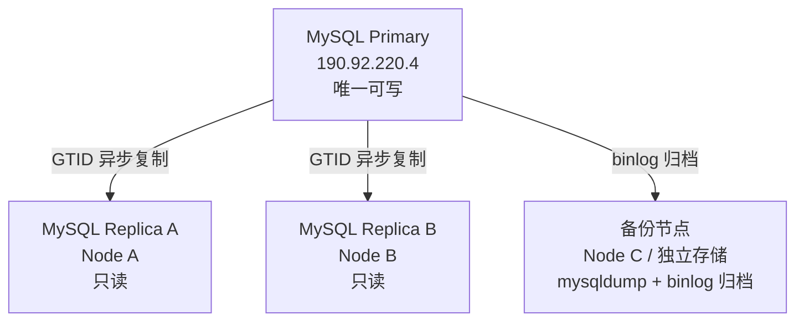

**容灾原则**：
- 永远只有一个可写主库
- 副本只读，不参与业务写
- 切换主库前必须隔离旧主（整机关机、云平台隔离或停止旧主及全部本机写入服务），仅 `iptables` 阻断 3306 不足以避免本机容器继续写入
- 第一阶段：人工确认 + 脚本执行（半自动）
- 复制解决硬件故障，历史备份解决误删除和逻辑破坏

### 5.2 故障矩阵

| 故障类型 | 恢复方式 | RTO | 数据风险 | 自动/手动 |
|---------|---------|-----|---------|----------|
| Collector 宕机 | 租约过期 → 其他节点接管 | ≤ 65 秒 | 无（检查点 + 幂等） | 自动 |
| Query 宕机 | Nginx 摘掉故障实例 | < 5 秒（健康检查 + 重试窗口） | 无（只读） | 自动 |
| Control 宕机 | 单活阶段切换 Green；Active-Active 阶段由 Nginx 摘除 | 单活 5~15 分钟；双活 < 5 秒 | 无（状态在 DB） | 分阶段 |
| Scheduler 宕机 | 第一阶段重启；Leader Lease 阶段由 Standby 接管 | 1 分钟；后期 ≤ 90 秒 | 无（无新任务但不丢已有任务） | 分阶段 |
| MySQL Primary 宕机 | 副本提升 | 5~15 分钟 | 可能丢失未复制的已提交事务 | 手动 |
| MySQL Replica 宕机 | 切换到其他副本或 Primary | 0 秒 | 无 | 自动 |
| 整机宕机（190.92.220.4） | 副本提升 + DNS 切流 | 15~30 分钟 | 可能丢失尚未复制到任一 Replica 的已提交事务；实际 RPO 由 GTID 差距、复制延迟和 Binlog 归档间隔决定 | 手动 |

### 5.3 MySQL 主备切换 SOP

##### 前置准备（一次性配置）

- 两个副本均配置 `log_replica_updates = ON`
- 两个副本均配置 `read_only = ON` + `super_read_only = ON`
- **`db.internal` 实现为自建内部 DNS**（低 TTL 30s，主备切换时更新 A 记录），不使用 `/etc/hosts` 或 MagicDNS
- **Fencing**：仅阻断外部 3306 不够——同一主机上的 Control/Scheduler/Collector 仍可通过 localhost 或 Docker 网络连接旧 MySQL。必须完成以下之一：

| 环境 | Fencing 方式 |
|------|-------------|
| 阿里云 ECS | **实例关机**（不是仅安全组阻断） |
| 物理机 / 自有 VM | SSH 远程关机 / 停止 MySQL + Control + Scheduler 容器 |
| 通用 | 云平台隔离整台实例 |

##### 切换前检查清单

```bash
# 对每个候选副本执行
REPLICA_HOST="$1"

echo "=== 检查复制线程状态 ==="
mysql -h "$REPLICA_HOST" -e "SHOW REPLICA STATUS\G" | grep -E "
  Replica_IO_Running|Replica_SQL_Running|Seconds_Behind_Source|
  Last_IO_Error|Last_SQL_Error|Retrieved_Gtid_Set|Executed_Gtid_Set|
  Master_Log_File|Read_Master_Log_Pos|Relay_Master_Log_File|Exec_Master_Log_Pos
"
```

必须满足：
```
□ Replica_IO_Running = Yes
□ Replica_SQL_Running = Yes
□ Last_IO_Error 为空
□ Last_SQL_Error 为空
□ Seconds_Behind_Source = 0
```

如果两个副本都健康，选择 **`Executed_Gtid_Set` 更完整** 的那个。

##### ⚠️ 异步复制的 RPO 声明

如果旧主彻底宕机，无法确认其最后提交但尚未复制到副本的事务。**异步复制下 RPO 可能大于 0**。如果业务要求 RPO = 0（不能接受任何已提交事务丢失），需要使用半同步复制或 Group Replication（不在当前方案范围内）。

##### 流程一：计划切换（Switchover）

**适用场景**：Primary 正常运行，需要维护或主动切换。

```
1. 停止全部写入（Control + Scheduler + Collector drain）
2. 等待所有副本追平（Seconds_Behind_Source = 0，并验证 GTID 集合）
3. 验证副本 GTID 是 Primary 的子集
4. 原 Primary 设为 read_only
5. 候选副本：STOP REPLICA → RESET REPLICA → read_only=OFF → super_read_only=OFF
6. 更新 db.internal DNS 指向新 Primary
7. 其他副本：CHANGE REPLICATION SOURCE TO 新 Primary
8. 验证新主可写（ha_canary INSERT + ROLLBACK）
9. 恢复写入
```

##### 流程二：紧急切换（Failover）

**适用场景**：Primary 宕机/不可达，必须立即切换。此时 Replica I/O 线程通常已断开——不能要求 `Replica_IO_Running = Yes`。

```
1. Fence 旧 Primary（关机/隔离整机，不依赖旧主自己执行）
2. 停止所有 Replica 的 I/O 线程（STOP REPLICA IO_THREAD）
3. 等待 Relay Log 执行完成：检查 Retrieved_Gtid_Set ⊆ Executed_Gtid_Set
    使用 GTID_SUBSET() 判断，不用字符串比较
4. 从所有可达 Replica 中选择 Executed_Gtid_Set 最完整的
5. 显式确认数据损失：
   如果其他 Replica 的 GTID 不是候选节点的子集 → 打印差异 → 要求 --force-accept-data-loss
6. 提升候选 Replica：STOP REPLICA → RESET REPLICA → read_only=OFF
7. 更新 db.internal DNS
8. 其他 Replica：从新 Primary 全量克隆（GTID 不一致时不宜直接 CHANGE REPLICATION SOURCE）
9. 旧 Primary 恢复后：全量克隆 → 作为新 Replica 加入（不原地重挂）
```

##### 切换脚本（Switchover，计划切换用）

> **状态：设计示例，未完成生产演练前禁止直接执行。** 本脚本要求 I/O、SQL 线程均健康，只适用于旧 Primary 仍可控的计划切换。紧急 Failover 时 Primary 不可达，Replica I/O 线程通常为 `Connecting/No`，必须按“流程二”先停止 I/O、执行完 Relay Log、使用 `GTID_SUBSET()` 判断集合包含关系；不得复用本脚本的健康检查。

```bash
#!/bin/bash
# promote_replica.sh — MySQL 副本提升为 Primary
set -euo pipefail

FORCE_ACCEPT_DATA_LOSS=false
if [[ "${1:-}" == "--force-accept-data-loss" ]]; then
    FORCE_ACCEPT_DATA_LOSS=true
    shift
fi
NEW_PRIMARY="${1:-}"

echo "=== Step 0: Fence 旧 Primary（在外部执行） ==="
echo "请确认旧 Primary 已通过以下方式之一隔离："
echo "  - 整机关机（云控制台 / 物理断电）"
echo "  - 整机网络隔离"
echo "  - 停止旧 Primary 上的 MySQL + Control + Scheduler 容器"
echo ""
echo "仅阻断 3306 端口或 Tailscale ACL 撤销不足以保证 fencing，"
read -p "旧 Primary 已隔离？(yes/no): " confirmed
[[ "$confirmed" != "yes" ]] && exit 1

echo "=== Step 1: 选择数据最完整的副本 ==="
GTID_A=$(mysql -h node-a -N -e "SELECT @@GLOBAL.gtid_executed" 2>/dev/null || echo "")
GTID_B=$(mysql -h node-b -N -e "SELECT @@GLOBAL.gtid_executed" 2>/dev/null || echo "")

# 使用 GTID_SUBSET 自动判断（不需要人工肉眼比较字符串）
if [[ -n "$GTID_A" && -n "$GTID_B" ]]; then
    A_CONTAINS_B=$(mysql -h node-a -N -e "SELECT GTID_SUBSET('$GTID_B', '$GTID_A')")
    B_CONTAINS_A=$(mysql -h node-b -N -e "SELECT GTID_SUBSET('$GTID_A', '$GTID_B')")

    if [[ "$NEW_PRIMARY" == "node-a" && "$A_CONTAINS_B" != "1" ]]; then
        echo "ERROR: Node A 的 GTID 不是 Node B 的超集！停止切换"
        exit 1
    elif [[ "$NEW_PRIMARY" == "node-b" && "$B_CONTAINS_A" != "1" ]]; then
        echo "ERROR: Node B 的 GTID 不是 Node A 的超集！停止切换"
        exit 1
    elif [[ "$A_CONTAINS_B" != "1" && "$B_CONTAINS_A" != "1" ]]; then
        echo "ERROR: 两个副本的 GTID 互不为超集，可能存在脑裂！禁止自动提升"
        exit 1
    fi
fi

# 检查候选节点 GTID 可读取
GTID_CANDIDATE=$(mysql -h "$NEW_PRIMARY" -N -e "SELECT @@GLOBAL.gtid_executed" 2>/dev/null)
if [[ -z "$GTID_CANDIDATE" ]]; then
    echo "ERROR: 无法读取候选节点 $NEW_PRIMARY 的 GTID，可能存在连接问题"
    exit 1
fi

echo "=== Step 2: 强制校验复制健康状态 ==="
REPLICA_STATUS=$(mysql -h "$NEW_PRIMARY" -N -e "SHOW REPLICA STATUS\G")
IO_RUNNING=$(echo "$REPLICA_STATUS" | grep Replica_IO_Running | awk '{print $2}')
SQL_RUNNING=$(echo "$REPLICA_STATUS" | grep Replica_SQL_Running | awk '{print $2}')
IO_ERROR=$(echo "$REPLICA_STATUS" | grep Last_IO_Error | awk -F': ' '{print $2}')
SQL_ERROR=$(echo "$REPLICA_STATUS" | grep Last_SQL_Error | awk -F': ' '{print $2}')
SECONDS_BEHIND=$(echo "$REPLICA_STATUS" | grep Seconds_Behind_Source | awk '{print $2}')
RETRIEVED_GTID=$(echo "$REPLICA_STATUS" | grep Retrieved_Gtid_Set | awk -F': ' '{print $2}')
EXECUTED_GTID=$(echo "$REPLICA_STATUS" | grep Executed_Gtid_Set | awk -F': ' '{print $2}')

# 强制校验，任一不满足 → 退出
[[ "$IO_RUNNING" != "Yes" ]] && echo "ERROR: Replica_IO_Running=$IO_RUNNING" && exit 1
[[ "$SQL_RUNNING" != "Yes" ]] && echo "ERROR: Replica_SQL_Running=$SQL_RUNNING" && exit 1
[[ -n "$IO_ERROR" ]] && echo "ERROR: Last_IO_Error=$IO_ERROR" && exit 1
[[ -n "$SQL_ERROR" ]] && echo "ERROR: Last_SQL_Error=$SQL_ERROR" && exit 1
[[ "$RETRIEVED_GTID" != "$EXECUTED_GTID" ]] && echo "ERROR: Retrieved GTID not fully executed" && exit 1

if [[ "$SECONDS_BEHIND" != "0" ]]; then
    if [[ "$FORCE_ACCEPT_DATA_LOSS" != "true" ]]; then
        echo "ERROR: 副本落后 ${SECONDS_BEHIND}s。如需强制提升，传 --force-accept-data-loss"
        exit 1
    fi
    echo "WARN: --force-accept-data-loss 已设置，将以数据损失为代价提升"
fi

echo "=== Step 3: 提升为 Primary ==="
mysql -h "$NEW_PRIMARY" -e "
  STOP REPLICA;
  RESET REPLICA ALL;
  SET GLOBAL read_only = OFF;
  SET GLOBAL super_read_only = OFF;
  SET PERSIST read_only = OFF;
  SET PERSIST super_read_only = OFF;
"
echo "新 Primary: $NEW_PRIMARY"

echo "=== Step 4: 更新数据库连接入口 ==="
# db.internal 固定使用自建内部 DNS：
#   1. 更新 A 记录 db.internal → 新 Primary 的 Tailscale IP
#   2. 等待低 TTL（目标 30s）过期
#   3. 在所有应用节点验证解析结果
#   4. 重建数据库连接池或重启应用容器
echo "请更新内部 DNS：db.internal 指向 $NEW_PRIMARY，并验证所有应用节点解析结果"
read -p "连接入口已更新？(yes/no): " confirmed

echo "=== Step 5: 将另一个副本指向新主 ==="
# 动态计算另一个副本
if [[ "$NEW_PRIMARY" == "node-a" ]]; then
    OTHER_REPLICA="node-b"
elif [[ "$NEW_PRIMARY" == "node-b" ]]; then
    OTHER_REPLICA="node-a"
else
    echo "未知的 NEW_PRIMARY: $NEW_PRIMARY，请手动指定另一个副本"
    read -p "另一个副本的 hostname: " OTHER_REPLICA
fi

mysql -h "$OTHER_REPLICA" -e "
  STOP REPLICA;
  CHANGE REPLICATION SOURCE TO
    SOURCE_HOST='$NEW_PRIMARY',
    SOURCE_AUTO_POSITION = 1;
  START REPLICA;
"
echo "另一个副本 $OTHER_REPLICA 已指向新主"

echo "=== Step 6: 验证新主可用 ==="
mysql -h "$NEW_PRIMARY" -e "
  SELECT @@hostname, @@server_id, @@read_only, @@super_read_only;
  SHOW MASTER STATUS;
"
# 真实写入验证（SELECT 在 read_only=ON 时也会成功，不能验证可写性）
mysql -h "$NEW_PRIMARY" -e "
  CREATE TABLE IF NOT EXISTS control_db.ha_canary (
    id BIGINT AUTO_INCREMENT PRIMARY KEY,
    checked_at DATETIME NOT NULL
  );
  START TRANSACTION;
  INSERT INTO control_db.ha_canary(checked_at) VALUES (NOW());
  ROLLBACK;
"
echo "新主写入验证通过"

echo "=== Step 7: 验证另一个副本跟上新主 ==="
sleep 3
mysql -h "$OTHER_REPLICA" -e "SHOW REPLICA STATUS\G" | grep Seconds_Behind_Source

echo ""
echo "=== 切换完成 ==="
echo "新 Primary: $NEW_PRIMARY"
echo ""
echo "=== 旧主恢复后的处理 ==="
echo "旧主可能持有尚未复制到新主的额外事务（errant GTID），直接 CHANGE REPLICATION SOURCE 会导致数据分叉。"
echo ""
echo "安全流程："
echo ""
echo "  # 1. 旧主启动后立即设为只读"
echo "  mysql -h <旧主> -e \"SET GLOBAL read_only = ON; SET GLOBAL super_read_only = ON;\""
echo "  mysql -h <旧主> -e \"SET PERSIST read_only = ON; SET PERSIST super_read_only = ON;\""
echo ""
echo "  # 2. 比较 GTID"
echo "  mysql -h <旧主> -e \"SELECT @@GLOBAL.gtid_executed;\""
echo "  mysql -h $NEW_PRIMARY -e \"SELECT @@GLOBAL.gtid_executed;\""
echo ""
echo "  # 3. 如果旧主的 GTID 是新主的真子集（无 errant GTID）："
echo "     → 从新主全量克隆，作为 Replica 加入"
echo ""
echo "  # 4. 如果旧主有额外 GTID（errant GTID）："
echo "     → 导出额外事务，人工审查后决定注入还是丢弃"
echo "     → 从新主全量克隆后加入"
echo ""
echo "  禁止不经 GTID 比较直接 CHANGE REPLICATION SOURCE"
```

##### 旧主恢复后禁止直接写入

旧主修复/重启后，**禁止不经 GTID 比较直接重挂为新主的 Replica**——旧主可能持有 errant GTID。

安全流程：
1. 旧主启动后立即 `SET GLOBAL read_only = ON; SET GLOBAL super_read_only = ON;`
2. 比较旧主与当前 Primary 的 `@@GLOBAL.gtid_executed`
3. 如果旧主 GTID 是新主子集 → 从新主**全量克隆**后作为 Replica 加入
4. 如果旧主有额外 GTID → 导出额外事务，人工审查后注入或丢弃，再全量克隆加入
5. 绝不在旧主上执行 `CHANGE REPLICATION SOURCE TO` 后直接 `START REPLICA`

##### 切换后必须验证

```
□ 新主 SHOW MASTER STATUS 返回正常
□ 新主可以写入（简单的 INSERT + DELETE 测试）
□ 应用可以正常连接新主
□ 关键 API 返回正确数据
□ 另一个副本跟上新主（Seconds_Behind_Source = 0，并验证 GTID 集合）
□ 备份脚本指向新主或副本
```

---

### 5.4 读写一致性策略

#### 5.4.1 问题：异步复制的查询延迟

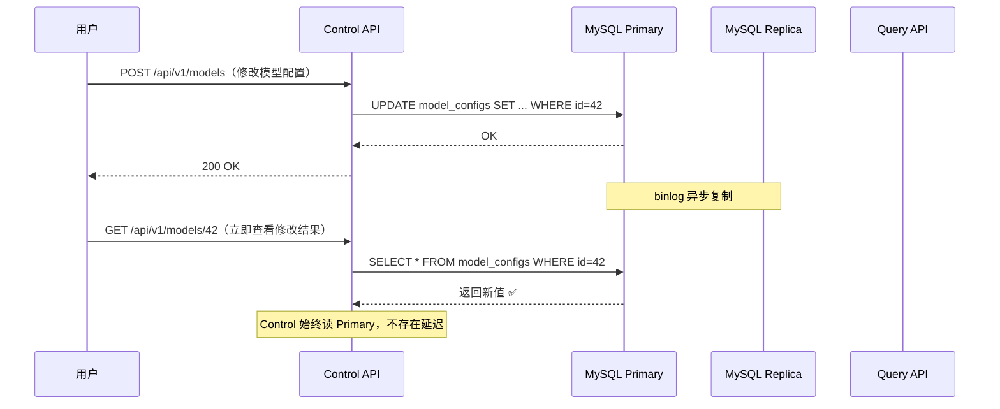

**典型场景**：

| 场景 | 写入方 | 读取方 | 用户感知 |
|------|--------|--------|---------|
| 管理员修改告警规则 → 立即查看 | Control | Query（读副本） | "我改了怎么没生效？" |
| 管理员创建新用户 → 立即登录 | Control | Control（读副本） | "刚创建的用户登不上" |
| 修改 LLM Provider 配置 → 测试连接 | Control | Control | "配置没更新" |
| Collector 写入新 CI 数据 → 用户刷新看板 | Collector | Query（读副本） | 通常可接受（数据本身就是历史的） |

#### 5.4.2 按业务分类：强一致 vs 最终一致

```mermaid
flowchart TB
    subgraph STRONG["强一致性 · 读 Primary"]
        S1["用户/权限/角色<br/>（写后立即需要生效）"]
        S2["系统配置 / 告警规则<br/>（安全相关，不容延迟）"]
        S3["LLM Provider 配置<br/>（写后立即测试连接）"]
        S4["采集策略<br/>（修改后应立即生效）"]
    end

    subgraph EVENTUAL["最终一致性 · 读 Replica（可接受）"]
        E1["CI 数据 / Job 状态<br/>（本身就有采集延迟）"]
        E2["性能指标 / 趋势<br/>（历史数据，秒级延迟无感）"]
        E3["模型报告<br/>（非实时数据）"]
        E4["NPU 资源指标<br/>（数据本身有采集间隔）"]
    end

    STRONG --> PRIMARY_R["→ MySQL Primary"]
    EVENTUAL --> REPLICA_R["→ MySQL Replica"]
```

#### 5.4.3 实现方案

**Control API → 始终读写 Primary**（配置类数据，QPS 极低）。

**Query API → 按查询类别选择读源**。轻量列表与详情第一阶段仍可读 Primary；经过压测确认的历史分析查询优先读 Replica。不要仅因为接口属于 Query Service 就默认所有查询都读副本。

Replica 读源 fallback 链：

```
Replica A → Replica B → Primary
```

Query readiness 验证：
- 数据库可连接
- 复制线程健康（Replica_IO_Running=Yes, Replica_SQL_Running=Yes）
- 复制延迟 < 阈值（Seconds_Behind_Source < 10）
- 复制心跳表时间戳未超过阈值
- 对需要明确写后读的请求，可携带写入时 GTID watermark，并用 `WAIT_FOR_EXECUTED_GTID_SET()` 等待到限定超时

`Seconds_Behind_Source` 可能为 `NULL`，且不能单独证明业务数据已经达到调用方需要的位置，因此不能作为唯一 readiness 条件。

连接失败或延迟超阈值时自动切换下一个读源。
- 轻量查询（dashboard 卡片、列表）：允许 fallback 到 Primary
- 分析查询（趋势、聚合、报表）：Replica 全部不可用时返回降级提示

```python
# Query 读源 fallback
ANALYTICS_READ_SOURCES = [
    "mysql+aiomysql://query_svc@replica-a.internal:3306/telemetry_db",
    "mysql+aiomysql://query_svc@replica-b.internal:3306/telemetry_db",
]

# 只有标记为 lightweight=true 的查询才允许追加 Primary fallback。
# 趋势、聚合、报表等重型查询在全部 Replica 不可用时返回明确降级结果。
```

#### 5.4.4 推荐策略

```
阶段 1（副本部署前）：
  → 不存在副本延迟问题，所有服务读写 Primary

阶段 2（副本部署后）：
  → Control API：始终读写 Primary（配置数据 QPS 低）
  → Query 轻量接口：Primary 或经过验证的 Replica
  → Query 重型分析：默认读 Replica，不自动 fallback Primary
  → 关键接口（用户信息、配置查询）显式走 Primary

阶段 3（可选优化）：
  → 对需要写后读一致性的响应返回 GTID watermark
  → Query 在 Replica 使用 WAIT_FOR_EXECUTED_GTID_SET() 做限定超时等待
  → 超时后按接口类型降级；重型分析查询不自动 fallback 到 Primary
```

**为什么 Control 读写 Primary 没问题**：

Control 的 QPS 极低（用户管理、配置修改，每分钟个位数），全部压在 Primary 上对性能影响为零。这样也就不需要担心"改完配置立刻查"的延迟问题——因为 Control 本来就读 Primary。

能容忍副本延迟的只有 Query——看板展示的 CI 数据、性能指标本身就是历史数据，晚几秒看到无所谓。

---

## 六、运维配置速查

### 6.1 MySQL 关键配置（`deploy/config/mysql.cnf`）

以下是 **Phase 0 完成后** 的正式配置。Phase 0 之前 binlog 相关项为注释状态，`innodb_flush_log_at_trx_commit = 2`；Phase 0 后改为以下内容。

```ini
[mysqld]
# 字符集
character-set-server = utf8mb4
collation-server = utf8mb4_unicode_ci

# 连接
max_connections = 200
max_allowed_packet = 64M

# InnoDB
innodb_buffer_pool_size = 256M
innodb_flush_log_at_trx_commit = 1    # Phase 0 改为 1
innodb_flush_method = O_DIRECT

# Binlog（Phase 0 开启）
server_id = 1
log_bin = /var/log/mysql/mysql-bin
binlog_format = ROW
sync_binlog = 1                       # Phase 0 改为 1

# GTID（Phase 0 开启）
gtid_mode = ON
enforce_gtid_consistency = ON

# Binlog 保留与副本提升准备
binlog_expire_logs_seconds = 604800   # 7 天（根据备份间隔 + 恢复窗口确定）
log_replica_updates = ON              # 副本可能被提升为主库

# 慢查询
slow_query_log = 1
long_query_time = 2
```

**注意**：Docker 部署下 binlog 写入路径 `/var/log/mysql/` 在容器内。必须在 `docker-compose.prod.yml` 中将该路径挂载到持久卷：

```yaml
services:
  mysql:
    volumes:
      - mysql_data:/var/lib/mysql
      - /data/mysql/binlog:/var/log/mysql   # bind mount，宿主机可直接访问 binlog
```

### 6.2 节点标签规范

```yaml
# /etc/vllm-dashboard/node-labels
zone: aliyun           # aliyun | office-a | office-b
storage: ssd           # ssd | hdd
compute: high          # high | standard | low
database_eligible: true  # true | false
availability: stable    # stable | best-effort
```

### 6.3 数据库账户权限矩阵

| 账户 | 权限范围 | 用途 |
|------|---------|------|
| `control_svc` | control_db: SELECT, INSERT, UPDATE, DELETE | Control API（全部读写 Primary） |
| `collector_svc` | collection_db: SELECT, INSERT, UPDATE<br/>telemetry_db: SELECT, INSERT, UPDATE | Collector |
| `query_svc` | telemetry_db: SELECT<br/>collection_db: SELECT | Query API（只读，查询采集结果） |
| `scheduler_svc` | collection_db: SELECT, INSERT, UPDATE | Scheduler |
| `migration_svc` | 原 Schema: ALTER, DROP<br/>新 Schema: CREATE, INSERT, ALTER, DROP, INDEX, CREATE VIEW<br/>（RENAME TABLE 需要旧库 DROP + 新库 CREATE/INSERT） | **仅部署期间使用**，部署完成后锁定 |
| `backup_svc` | ALL DATABASES: SELECT, LOCK TABLES, SHOW VIEW, TRIGGER, RELOAD, REPLICATION CLIENT | 备份（从副本执行）<br/>`--source-data=2` 需要 RELOAD + REPLICATION CLIENT |
| `replica_svc` | ALL DATABASES: REPLICATION SLAVE | 副本同步（限制来源 IP、使用 TLS） |

**注意**：
- `collector_svc` 没有 `DROP`、`ALTER`、`GRANT` 权限。
- `object_store` 凭据不属于数据库权限矩阵，应放到"外部服务凭据矩阵"。
- Query 不需要 `control_db` 权限——配置查询全部走 Control API。

---

## 七、实施路线图

```mermaid
gantt
    title 架构演进实施路线图
    dateFormat  YYYY-MM-DD
    axisFormat  %m/%d

    section Phase 0 安全基线
    状态资产 + Secret 基线   :p00, 2026-08-01, 2d
    备份 + 开启 binlog/GTID  :p0, after p00, 2d
    验证 PITR + 补监控       :p0b, after p0, 2d
    首个 Replica（有节点时）  :p0c, after p0b, 3d

    section Phase A 原地重构
    拆 Scheduler            :a1, after p0b, 3d
    拆 DB Migration         :a2, after a1, 1d
    进度持久化 + Outbox      :a3, after a2, 4d
    租约/检查点/幂等         :a4, after a3, 5d
    同镜像多 command         :a5, after a4, 2d
    预构建镜像               :a6, after a5, 2d

    section Phase B 按需水平扩展
    Tailscale 私网 + ACL     :b1, after a6, 2d
    数据所有权/账户隔离        :b2, after b1, 3d
    多 Collector 部署        :b3, after b2, 3d

    section Phase C 容灾加固
    首个副本就绪后增加第二副本 :c1, after b3, 3d
    主备切换脚本 + 故障演练    :c2, after c1, 5d
    Profiling → C++（按需）  :c3, after c2, 5d
```

**预估总周期**：仅完成两设备可运行的 Phase 0 基线 + Phase A，约 **4~5 周**；新增节点后再执行 Replica、Phase B和Phase C，完整目标约 **8~9 周**。首个Replica、旧表批量跨Schema迁移和C++ Worker都是条件步骤，不阻塞单生产节点完成服务隔离和可扩展性改造。

每个 Step 完成后设置检查点：

```
□ 冒烟测试通过
□ 核心 API 响应正常
□ 一个完整采集周期数据正常
□ 用户数/表数/关键数据行数未减少
□ 单生产节点可以独立运行全部必需角色
□ 新增标准节点时不修改业务代码和数据库 Schema
□ 新 Worker 启动后自动参与任务领取
□ Worker drain 或突然掉线后任务可以释放/接管
```

---

## 八、开放问题

以下问题待讨论决定：

1. **Scheduler 高可用启用时机**：协议确定为 MySQL Leader Lease；待多 Collector 稳定后决定何时启用第二 Scheduler。
2. **MySQL 自动 failover**：当前方案是半自动（人工确认 + 脚本）。未来是否考虑引入 Orchestrator / MHA 做自动切换？
3. **镜像仓库选型**：GitHub Container Registry（免费、海外）vs 阿里云 ACR（国内快、收费）vs 自建？
4. **节点故障域**：Node A/B 实际位于哪个地点、是否共用电源和网络；这决定它们能否算作两个独立容灾副本。
5. **标准节点落地方式**：Windows 统一通过 Hyper-V Ubuntu VM 提供 Linux 节点；未来原生 Linux 使用相同节点契约。仍需确定每台机器的资源配额。
6. **ClickHouse 引入的触发条件**：telemetry_db 超过多大或查询超过多慢才引入？
7. **C++ Worker 的 profiling 标准**：CPU 占用超过多少、或大文件解析耗时占比超过多少才值得引入？
8. **备份策略演进**：当前每小时完整 dump 不随数据增长缩放。需要根据实际库大小确定全量频率、Binlog归档频率和保留期。
9. **内部 DNS 实现**：`db.internal` 已确定使用低 TTL 自建内部 DNS，仍需确定 DNS 服务部署位置、更新权限和入口自身容灾。
10. **监控与告警通道**：指标范围已定义，仍需决定 Prometheus/云监控实现以及邮件、IM 或电话告警方式。
11. **Secret 工具选型**：安全基线和分发规则已确定，仍需在 SOPS/age、Vault 或现有密码管理方案中选型。
12. **对象存储选型**：自建 S3 兼容存储或云对象存储，以及版本保留和生命周期策略。
13. **K3s 引入阈值**：只有稳定计算节点达到3~5个、Compose/Inventory运维成为实际瓶颈时再评估；不作为两设备起步的前置条件。

---

## 附录：多节点 Compose 文件结构

普通 `docker compose` 的 `deploy.replicas` 需要 Swarm 模式，不适用于当前场景。多节点部署采用**按角色组合 Compose + Inventory + Ansible/SSH 推送**。节点名称不决定角色，Windows Ubuntu VM 与原生 Linux 使用同一组角色文件。

```
deploy/
├── compose.base.yml
├── compose.control.yml
├── compose.query.yml
├── compose.collector.yml
├── compose.mysql-primary.yml
├── compose.mysql-replica.yml
├── compose.backup.yml
├── compose.monitoring.yml
├── inventory.yml             # Ansible 部署清单
└── deploy.sh                 # 按节点推送 + 重启
```

**角色组合示例**：

```bash
# 当前 Primary 节点
docker compose -f compose.base.yml \
  -f compose.control.yml \
  -f compose.mysql-primary.yml up -d

# 任意 Ubuntu VM 或原生 Linux Collector/Replica 节点
docker compose -f compose.base.yml \
  -f compose.collector.yml \
  -f compose.query.yml \
  -f compose.mysql-replica.yml up -d
```

**compose.control.yml**：
```yaml
services:
  control:
    image: ghcr.io/meng/vllm-dashboard:${VERSION}
    command: python -m api.main
    # ...

  scheduler:
    image: ghcr.io/meng/vllm-dashboard:${VERSION}
    command: python -m scheduler
    # ...
```

**compose.collector.yml / compose.query.yml / compose.mysql-replica.yml**：
```yaml
services:
  collector:
    image: ghcr.io/meng/vllm-dashboard:${VERSION}
    command: python -m collector
    environment:
      - NODE_ID=node-a-collector-1
      - CAPABILITIES=python
      # ...

  query:
    image: ghcr.io/meng/vllm-dashboard:${VERSION}
    command: python -m app.query
    # ...

  mysql-replica:
    image: mysql:8.0.35  # 锁定精确小版本
    # Replica 配置，server_id=2, read_only=ON...
```

**Inventory 从最小形态扩展到多节点**：

```yaml
nodes:
  ingress-1:
    address: 123.57.0.174
    roles: [ingress]

  prod-1:
    address: 190.92.220.4
    roles: [frontend, control, query, scheduler, collector, mysql-primary]
    labels:
      zone: aliyun
      availability: stable
      database_eligible: true

  # 有新设备时只追加节点；prod-1 无需改变接口。
  worker-office-a-01:
    address: 100.64.0.21
    roles: [collector]
    labels:
      zone: office-a
      availability: best-effort
      database_eligible: false
    capabilities: [python-collector]

  worker-office-b-01:
    address: 100.64.0.22
    roles: [collector, query, mysql-replica]
    labels:
      zone: office-b
      storage: ssd
      availability: stable
      database_eligible: true
    capabilities: [python-collector, cpp-log-parser]
```

当额外节点不存在时，Inventory 只包含 `ingress-1` 和 `prod-1`，部署仍然完整有效。新增节点是追加容量，不是切换到另一套架构。

**节点标签**（`/etc/vllm-dashboard/node-labels`）仅作文档和部署脚本参考，不依赖调度器自动读取：

```yaml
# Node A
zone: office-a
storage: ssd
compute: high
database_eligible: true
availability: stable
```

Inventory 负责把角色分配给节点；新增 Linux 节点时只增加 Inventory 条目，不复制新的 `compose-node-x.yml`。数据库角色只能分配给 `database_eligible=true` 且磁盘、备份和故障域检查通过的节点。

---

> **关联文档**：
> - [架构改进](./架构改进.md) — 原始架构设计
> - [生产环境部署规范](./production-upgrade-guide.md) — 当前部署流程（部分过时）
>
> **文档版本**: v0.11
> **创建日期**: 2026-07-27
> **最后更新**: 2026-08-05
> **状态**: 测试环境实施稿
> **更新记录**：
> - v0.11：统一MySQL 8.0的SOURCE/REPLICA术语；删除db.internal的`/etc/hosts`分支；用GTID watermark替换Query死引用；修正租约Token、失败字段、监控口径和异步复制RPO表述；统一镜像Registry变量；明确Step 10的首个Replica前置条件；将当前单库且缺少`--source-data=2`的备份脚本列为PITR与跨Schema迁移实施门禁。
> - v0.10：明确“跳板机 + 单生产节点”是完整最小运行形态；目标改为1~N标准计算节点；首个Replica改为有新增节点时的条件步骤，不阻塞单机重构；补充标准节点契约、能力标签、加入/退出流程、Compose/Inventory与K3s两级弹性策略，以及最小到多节点的Inventory示例。
> - v0.9：前移状态资产、Secret 与第一个 MySQL Replica；补充 Outbox 和对象存储；Control/Query 改为分阶段 Active-Active；逻辑数据库改为渐进所有权隔离、批量 RENAME 作为可选 Runbook；明确 Switchover 脚本禁止用于紧急 Failover；Compose 改为按角色组合，统一 Windows Ubuntu VM 与原生 Linux 节点契约；补充 Scheduler Leader Lease 和 Query GTID watermark。
> - v0.7：PITR 示例补全密码/健康检查/binlog 挂载、Failover 拆为 Switchover+Failover 双流程、Collector 生命周期闭环（add_done_callback+Semaphore+future 追踪）、execution_count/failure_count 拆分、lease_generation 语义限定、迁移停机范围补全（Query+metadata lock 检查）、锁定 Control Active-Active + db.internal=自建 DNS + Query 分级 fallback、状态图删 skipped、架构图去 Control Standby
> - v0.6：合并扩缩容方案、修正 Trigger+RENAME TABLE、权限矩阵、Collector 代码、dedupe_key、主备切换、PITR、读写一致性
> - v0.5：文档合并
> - v0.1~v0.4：初稿至实施前评审


